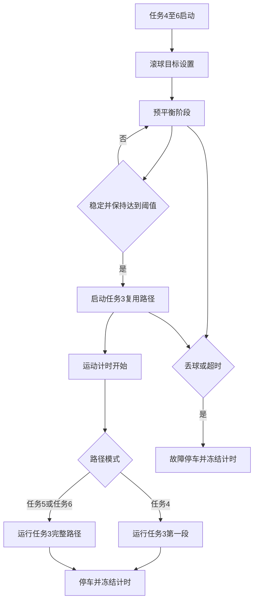

# 任务4~6编写与调试方案：任务3循迹复用 + 滚球预平衡 + 运动计时

## 1. 文档目标

本文用于指导赛题任务4、任务5、任务6的代码编写、联调与现场调参。当前工程已完成任务3循迹基础能力，任务4~6应在任务3路径复用的基础上叠加滚球保持能力。按用户最新修正，三项任务定义如下：

| 赛题任务 | 路径要求 | 滚球目标 |
| --- | --- | --- |
| 任务4 | A→B 循迹 | 0 刻度滚球保持 |
| 任务5 | A→A 循迹 | 0 刻度滚球保持 |
| 任务6 | A→A 循迹 | 任意整数刻度滚球保持 |

最终目标是：任务4/5/6启动后，先让钢球移动到指定刻度并稳定保持一段可调时间，默认约 6 s；随后开始小车运动，并在运动开始瞬间开始计时；到达终点或停车时停止并冻结计时。运动路径不再为合并任务单独写一套循迹逻辑，而是复用任务3的循迹状态机：任务4的 A→B 只运行任务3第一段，任务5/6的 A→A 运行完整任务3。

## 2. 当前工程基础与约束

### 2.1 主要文件分工

| 文件 | 作用 | 本方案中的地位 |
| --- | --- | --- |
| [`BALANCE/contest_task.c`](../BALANCE/contest_task.c) | 赛题任务状态机、任务3循迹、任务5合并任务 | 主要改动位置 |
| [`BALANCE/contest_task.h`](../BALANCE/contest_task.h) | 任务编号、任务上下文结构体、合并任务模式宏 | 需要增加任务5子状态和计时字段 |
| [`BALANCE/ball_control.c`](../BALANCE/ball_control.c) | 滚球 PID、舵机输出、稳定判据、丢球保护 | 复用现有滚球闭环 |
| [`BALANCE/ball_control.h`](../BALANCE/ball_control.h) | 滚球参数结构体与默认舵机、前馈配置 | 需要现场调参参考 |
| [`BALANCE/track_control.c`](../BALANCE/track_control.c) | 公共红外循迹控制模块 | 由任务3间接调用，不建议任务5重复直接编排 |
| [`BALANCE/system.c`](../BALANCE/system.c) | 系统初始化入口 | 确认初始化顺序即可 |
| [`USER/WHEELTEC.uvprojx`](../USER/WHEELTEC.uvprojx) | Keil 工程文件 | 不修改 |

### 2.2 工程约束

- 工程以 Keil MDK 项目为准，磁盘上新增 C 文件不会自动参与编译；本方案优先在已有文件内改造，避免改动 [`USER/WHEELTEC.uvprojx`](../USER/WHEELTEC.uvprojx)。
- 定时器资源紧张，TIM8 CH4 / PC9 已用于舵机 PWM，任务4~6不应新增舵机定时器。
- 业务任务由 [`USER/main.c`](../USER/main.c) 进入 [`systemInit()`](../BALANCE/system.c)，再进入 FreeRTOS 任务调度；任务状态机应沿用现有周期调用方式。
- 新逻辑应保持比赛实用性，避免引入复杂抽象和大规模重构。

## 3. 任务4~6总体功能定义

### 3.1 任务4：A→B 循迹 + 0 刻度滚球保持

任务4是第一个真正的“循迹 + 滚球”合并任务，路径为 A→B，只运行任务3的第一段直线循迹；滚球目标固定为 0 刻度。

流程为：

1. 选择任务4入口。
2. 设置滚球目标为 0 刻度。
3. 启动预平衡阶段，只启用滚球闭环，小车不动。
4. 钢球达到稳定条件并持续约 6 s 后，开始运动与计时。
5. 运动阶段复用任务3第一段直线循迹。
6. 完成第一段到达 B 点后停车，冻结运动计时。

### 3.2 任务5：A→A 循迹 + 0 刻度滚球保持

任务5路径为 A→A，运行任务3完整路径；滚球目标固定为 0 刻度。

流程为：

1. 选择任务5入口。
2. 设置滚球目标为 0 刻度。
3. 启动预平衡阶段，只启用滚球闭环，小车不动。
4. 钢球达到稳定条件并持续约 6 s 后，开始运动与计时。
5. 运动阶段复用任务3完整路径。
6. 返回 A 点后停车，冻结运动计时。

### 3.3 任务6：A→A 循迹 + 任意整数刻度滚球保持

任务6路径同任务5，也是 A→A 并运行任务3完整路径；区别是滚球目标不再固定为 0 刻度，而是由用户通过按键、OLED 配置或已有变量设置为任意整数刻度。

流程为：

1. 选择任务6入口。
2. 设置滚球目标为指定整数刻度。
3. 启动预平衡阶段，只启用滚球闭环，小车不动。
4. 钢球达到指定刻度并稳定保持约 6 s 后，开始运动与计时。
5. 运动阶段复用任务3完整路径。
6. 返回 A 点后停车，冻结运动计时。

## 4. 推荐软件架构

### 4.1 核心原则

任务4/5/6不再分别拥有独立循迹流程，而是统一作为“合并任务编排器”：

- 滚球闭环由 [`Ball_Control_Update()`](../BALANCE/ball_control.c) 负责。
- 红外循迹与路径阶段由任务3核心逻辑负责。
- 合并任务只决定任务编号对应的路径模式、滚球目标刻度、何时开始滚球、何时允许运动以及何时停止计时。

### 4.2 状态机分层

建议为任务4/5/6共用一套合并任务子状态：

| 子状态 | 含义 | 电机 | 舵机滚球 | 计时 |
| --- | --- | --- | --- | --- |
| PRE_BALANCE | 预平衡 | 停止 | 使能 | 不计时 |
| MOTION | 运动执行 | 由任务3输出 | 使能 | 计时 |
| FINISH | 正常完成 | 停止 | 可保持或关闭 | 冻结 |
| FAIL | 异常停车 | 停止 | 视情况保持或关闭 | 冻结 |

推荐新增宏名如下：

- `CONTEST_MERGED_RUN_PRE_BALANCE`
- `CONTEST_MERGED_RUN_MOTION`
- `CONTEST_MERGED_RUN_FINISH`
- `CONTEST_MERGED_RUN_FAIL`

### 4.3 总体流程图



## 5. 任务3复用方案

### 5.1 复用边界

任务3仍是路径状态机和循迹流程的真源，任务4/5/6复用任务3的阶段切换、直线/弯道控制框架和停车判据接口；但考虑任务4/5/6对运动时间要求较宽松，整圈小于等于 30 s 即可，因此任务4/5/6应使用一组独立的保守运动参数，不直接沿用任务3为速度优化而设置的速度、里程、yaw/红外比例和弯道前馈参数。

建议把当前任务3逻辑拆成以下内部接口：

| 建议内部函数 | 作用 |
| --- | --- |
| `Contest_Task3_PathStart(mode)` | 初始化任务3路径运行上下文 |
| `Contest_Task3_PathStep(period_ms)` | 周期执行任务3一个控制步 |
| `Contest_Task3_PathIsFinished()` | 查询路径是否完成 |
| `Contest_Task3_PathStop()` | 停止任务3路径输出 |

如果为了减少改动，也可以不使用完全新命名，而是在 [`BALANCE/contest_task.c`](../BALANCE/contest_task.c) 中抽取 `static` 辅助函数。关键是任务3自身和任务4/5/6都调用同一套路径阶段逻辑，避免多套循迹状态机漂移；任务4/5/6只替换路径参数表，而不是复制一套新流程。

### 5.2 任务4~6独立运动参数组

任务4~6建议创建一组专用宏，完整覆盖任务3当前可调参数。命名建议统一使用 `CONTEST_MERGED_` 前缀，表示“任务4~6合并任务专用参数”，不要直接复用 `CONTEST_TASK2_` 前缀参数。

| 任务3原参数 | 任务4~6专用参数 | 用途 |
| --- | --- | --- |
| `CONTEST_TASK2_STRAIGHT1_DISTANCE_M` | `CONTEST_MERGED_STRAIGHT1_DISTANCE_M` | 第一段直行目标里程 |
| `CONTEST_TASK2_CURVE1_DISTANCE_M` | `CONTEST_MERGED_CURVE1_DISTANCE_M` | 第一个半圆弯道目标里程 |
| `CONTEST_TASK2_STRAIGHT2_DISTANCE_M` | `CONTEST_MERGED_STRAIGHT2_DISTANCE_M` | 第二段直行目标里程 |
| `CONTEST_TASK2_CURVE2_DISTANCE_M` | `CONTEST_MERGED_CURVE2_DISTANCE_M` | 第二个半圆弯道目标里程 |
| `CONTEST_TASK2_STOP_DISTANCE_M` | `CONTEST_MERGED_STOP_DISTANCE_M` | A→A 总里程停车位置 |
| `CONTEST_TASK2_BASE_SPEED` | `CONTEST_MERGED_STRAIGHT_SPEED` | 直线段基础速度 |
| `CONTEST_TASK2_CURVE_SPEED` | `CONTEST_MERGED_CURVE_SPEED` | 弯道循迹基础速度 |
| `CONTEST_TASK2_STRAIGHT1_YAW_SCALE` | `CONTEST_MERGED_STRAIGHT1_YAW_SCALE` | 第一段直行 yaw/IMU 环输出比例 |
| `CONTEST_TASK2_STRAIGHT1_LINE_SCALE` | `CONTEST_MERGED_STRAIGHT1_LINE_SCALE` | 第一段直行红外循迹环输出比例 |
| `CONTEST_TASK2_STRAIGHT2_YAW_SCALE` | `CONTEST_MERGED_STRAIGHT2_YAW_SCALE` | 第二段直行 yaw/IMU 环输出比例 |
| `CONTEST_TASK2_STRAIGHT2_LINE_SCALE` | `CONTEST_MERGED_STRAIGHT2_LINE_SCALE` | 第二段直行红外循迹环输出比例 |
| `CONTEST_TASK2_CURVE_FF_DELTA` | `CONTEST_MERGED_CURVE_FF_DELTA` | 弯道基础转向前馈差速 |
| `CONTEST_TASK2_CURVE_FF_RAMP_M` | `CONTEST_MERGED_CURVE_FF_RAMP_M` | 弯道前馈渐入里程 |
| `CONTEST_TASK2_CURVE_FF_SCALE` | `CONTEST_MERGED_CURVE_FF_SCALE` | 弯道前馈输出比例 |
| `CONTEST_TASK2_CURVE_LINE_SCALE` | `CONTEST_MERGED_CURVE_LINE_SCALE` | 弯道红外 PID 输出比例 |

建议初始值可以先拷贝任务3当前实测可用值，再按任务4~6滚球稳定需求降速和微调：

```c
#define CONTEST_MERGED_STRAIGHT1_DISTANCE_M     1.44f
#define CONTEST_MERGED_CURVE1_DISTANCE_M        ((3.1416f * CONTEST_TASK2_CURVE_RADIUS_M) + 0.04f)
#define CONTEST_MERGED_STRAIGHT2_DISTANCE_M     1.25f
#define CONTEST_MERGED_CURVE2_DISTANCE_M        ((3.1416f * CONTEST_TASK2_CURVE_RADIUS_M) + 0.04f)
#define CONTEST_MERGED_STOP_DISTANCE_M          5.72f
#define CONTEST_MERGED_STRAIGHT_SPEED           0.25f
#define CONTEST_MERGED_CURVE_SPEED              0.20f
#define CONTEST_MERGED_STRAIGHT1_YAW_SCALE      0.30f
#define CONTEST_MERGED_STRAIGHT1_LINE_SCALE     0.70f
#define CONTEST_MERGED_STRAIGHT2_YAW_SCALE      0.70f
#define CONTEST_MERGED_STRAIGHT2_LINE_SCALE     0.30f
#define CONTEST_MERGED_CURVE_FF_DELTA           0.06f
#define CONTEST_MERGED_CURVE_FF_RAMP_M          0.40f
#define CONTEST_MERGED_CURVE_FF_SCALE           0.60f
#define CONTEST_MERGED_CURVE_LINE_SCALE         0.30f
```

设计原则：

- 任务4只使用第一段相关参数：`CONTEST_MERGED_STRAIGHT_SPEED`、`CONTEST_MERGED_STRAIGHT1_DISTANCE_M`、`CONTEST_MERGED_STRAIGHT1_YAW_SCALE`、`CONTEST_MERGED_STRAIGHT1_LINE_SCALE`。
- 任务5/6使用完整参数组，包含两段直行、两段弯道、总停车里程、yaw/红外比例和弯道前馈。
- 任务4/5/6参数初值可以从任务3复制，但应独立调节，不要让任务4~6的保守调参影响已完成任务3。
- 直行速度和弯道速度应明显保守于任务3竞速参数，优先保证滚球稳定。
- 里程参数可以在任务3实测值基础上微调，但不要在任务4/5/6中新增独立状态机。
- 若滚球误差较大，仍可在该基础速度上叠加动态降速。

### 5.3 任务4 A→B 模式

任务4只允许任务3运行第一段，即当前任务3中的第一段直线阶段。推荐完成条件采用任务3第一段原有距离判据，而不是在任务4中另写距离参数。

执行策略：

1. 任务4进入 MOTION 子状态时，初始化任务3路径到第一段。
2. 每周期调用任务3路径单步函数。
3. 当任务3第一段完成时，任务5立即停车。
4. 冻结 `merged_motion_time_ms`。

### 5.4 任务5/6 A→A 模式

任务5/6运行完整任务3路径。执行策略：

1. 任务5或任务6进入 MOTION 子状态时，初始化任务3路径到第一段。
2. 每周期调用任务3路径单步函数。
3. 任务3按原有阶段依次切换：直线1、弯道1、直线2、弯道2。
4. 任务3完整完成后，任务5停车并冻结 `merged_motion_time_ms`。

## 6. 预平衡与运动计时方案

### 6.1 预平衡阶段

任务4/5/6启动后，首先执行预平衡：

- 调用滚球复位与目标设置。
- 启用滚球闭环。
- 电机目标速度保持为 0。
- 周期调用滚球控制。
- 持续检查稳定条件。

稳定条件建议使用现有滚球稳定判据，例如误差、速度和连续稳定计数。若现有 [`Ball_Control_IsStable()`](../BALANCE/ball_control.c) 已满足要求，则任务5直接复用它。

### 6.2 6 s 可调保持时间

新增可调参数：

- `CONTEST_MERGED_PRE_BALANCE_HOLD_MS`，默认 6000。
- `CONTEST_MERGED_PRE_BALANCE_TIMEOUT_MS`，用于防止一直无法起步。

推荐逻辑：

1. 若滚球稳定，累加 `merged_stable_hold_ms`。
2. 若滚球不稳定，清零或衰减 `merged_stable_hold_ms`。
3. 当 `merged_stable_hold_ms >= CONTEST_MERGED_PRE_BALANCE_HOLD_MS` 时，进入运动阶段。
4. 进入运动阶段的同一周期，将运动计时清零。

### 6.3 运动计时

任务4/5/6必须区分任务启动时间与成绩计时：

- `state_time_ms` 可继续表示任务状态存活时间。
- `phase_time_ms` 可继续表示阶段时间。
- 新增 `merged_motion_time_ms` 专门记录从起步到停车的运动时间。

计时规则：

- 预平衡阶段不累加 `merged_motion_time_ms`。
- 从进入 MOTION 子状态开始累加。
- 正常停车或故障停车时停止累加。
- OLED 或串口显示成绩时优先显示冻结后的 `merged_motion_time_ms`。

## 7. 建议修改点清单

### 7.1 [`BALANCE/contest_task.h`](../BALANCE/contest_task.h)

建议在合并任务上下文中增加字段：

| 字段 | 类型建议 | 用途 |
| --- | --- | --- |
| `merged_run_phase` | `uint8_t` | PRE_BALANCE / MOTION / FINISH / FAIL |
| `merged_pre_balance_ms` | `uint32_t` | 预平衡累计时间 |
| `merged_stable_hold_ms` | `uint32_t` | 连续稳定保持时间 |
| `merged_motion_time_ms` | `uint32_t` | 运动成绩计时 |
| `merged_motion_time_frozen_ms` | `uint32_t` | 停车后冻结显示值，可选 |
| `merged_path_done` | `uint8_t` | 任务3复用路径完成标志，可选 |

如果结构体空间和改动范围要尽量小，也可以复用已有字段，但不建议用 `state_time_ms` 代表成绩时间。

### 7.2 [`BALANCE/contest_task.c`](../BALANCE/contest_task.c)

建议重点改造以下部分：

1. 增加合并任务参数宏：
   - `CONTEST_MERGED_PRE_BALANCE_HOLD_MS`
   - `CONTEST_MERGED_PRE_BALANCE_TIMEOUT_MS`
   - `CONTEST_MERGED_BALL_LOST_STOP_ENABLE`
2. 修改任务4/5/6启动逻辑：
   - 只初始化滚球与合并任务上下文；
   - 按任务编号设置路径模式和滚球目标刻度；
   - 不立即启动循迹；
   - 不立即开始运动计时。
3. 增加预平衡周期函数：
   - 停车；
   - 调用滚球闭环；
   - 判断稳定保持时间；
   - 到达阈值后进入运动阶段。
4. 抽取任务3路径服务：
   - 任务3自身调用；
   - 任务4/5/6运动阶段也调用。
5. 修改任务4/5/6运动阶段：
   - 每周期先更新任务3路径；
   - 再更新滚球闭环；
   - 根据滚球误差缩放任务3输出速度；
   - 检查路径完成、丢球和超时。
6. 修改停车逻辑：
   - 正常完成与故障停车均冻结运动计时；
   - 电机目标置零；
   - 循迹控制停止；
   - 可选择继续保持滚球闭环。

### 7.3 [`BALANCE/ball_control.c`](../BALANCE/ball_control.c)

任务4~6原则上复用当前滚球控制，不建议在合并任务里重新写 PID。需要关注：

- PID 是否已能在静态调试中稳定到 0 刻度以及任务6需要的整数刻度。
- 舵机中位是否正确。
- 舵机方向是否正确。
- 角度限幅、斜率限幅是否过小导致响应慢，或过大导致震荡。
- 丢球保护是否过于敏感，导致运动中误停。

### 7.4 [`BALANCE/track_control.c`](../BALANCE/track_control.c)

任务4/5/6不应绕过任务3直接改写循迹路线。公共循迹参数仍在该文件内调节，但路线阶段切换应由任务3统一管理。

## 8. 参数调试清单

### 8.1 滚球控制参数

| 参数 | 位置 | 调试目的 |
| --- | --- | --- |
| `kp` | [`BallControlParam_t`](../BALANCE/ball_control.h) / 初始化处 | 主要回正力度 |
| `ki` | [`BallControlParam_t`](../BALANCE/ball_control.h) / 初始化处 | 消除静差，过大会饱和 |
| `kd` | [`BallControlParam_t`](../BALANCE/ball_control.h) / 初始化处 | 抑制快速变化，视觉跳变时容易放大 |
| `kf` | [`BallControlParam_t`](../BALANCE/ball_control.h) / 初始化处 | 加速度前馈系数，当前默认关闭 |
| `angle_limit_deg` | [`BallControlParam_t`](../BALANCE/ball_control.h) | 舵机目标角限幅 |
| `rate_limit_deg` | [`BallControlParam_t`](../BALANCE/ball_control.h) | 舵机输出斜率限幅 |
| `servo_mid_us` | [`BallControlParam_t`](../BALANCE/ball_control.h) | 舵机机械中位 |
| `servo_dir` | [`BallControlParam_t`](../BALANCE/ball_control.h) | 舵机控制方向 |
| `stable_error_0p1mm` | [`BallControlParam_t`](../BALANCE/ball_control.h) | 稳定误差阈值 |
| `stable_count_required` | [`BallControlParam_t`](../BALANCE/ball_control.h) | 稳定连续计数 |

### 8.2 合并任务参数

| 参数 | 建议初值 | 说明 |
| --- | --- | --- |
| `CONTEST_MERGED_PRE_BALANCE_HOLD_MS` | 6000 | 起步前稳定保持时间 |
| `CONTEST_MERGED_PRE_BALANCE_TIMEOUT_MS` | 15000 至 25000 | 预平衡最长等待时间 |
| `CONTEST_MERGED_STRAIGHT1_DISTANCE_M` | 1.44 或按赛道实测 | 第一段直行里程，任务4/5/6独立调节 |
| `CONTEST_MERGED_CURVE1_DISTANCE_M` | 任务3当前值或按赛道实测 | 第一段弯道里程，任务5/6独立调节 |
| `CONTEST_MERGED_STRAIGHT2_DISTANCE_M` | 1.25 或按赛道实测 | 第二段直行里程，任务5/6独立调节 |
| `CONTEST_MERGED_CURVE2_DISTANCE_M` | 任务3当前值或按赛道实测 | 第二段弯道里程，任务5/6独立调节 |
| `CONTEST_MERGED_STOP_DISTANCE_M` | 5.72 或按赛道实测 | A→A 总里程停车位置，任务5/6独立调节 |
| `CONTEST_MERGED_STRAIGHT_SPEED` | 0.25 左右 | 任务4/5/6独立直行速度，优先保球 |
| `CONTEST_MERGED_CURVE_SPEED` | 0.20 左右 | 任务5/6独立弯道速度，建议低于直行速度 |
| `CONTEST_MERGED_STRAIGHT1_YAW_SCALE` | 0.30 | 第一段直行 yaw/IMU 环比例 |
| `CONTEST_MERGED_STRAIGHT1_LINE_SCALE` | 0.70 | 第一段直行红外循迹比例 |
| `CONTEST_MERGED_STRAIGHT2_YAW_SCALE` | 0.70 | 第二段直行 yaw/IMU 环比例 |
| `CONTEST_MERGED_STRAIGHT2_LINE_SCALE` | 0.30 | 第二段直行红外循迹比例 |
| `CONTEST_MERGED_CURVE_FF_DELTA` | 0.06 至 0.08 | 弯道固定前馈差速，任务5/6独立调节 |
| `CONTEST_MERGED_CURVE_FF_RAMP_M` | 0.40 | 弯道前馈渐入里程 |
| `CONTEST_MERGED_CURVE_FF_SCALE` | 0.60 至 0.70 | 弯道前馈输出比例 |
| `CONTEST_MERGED_CURVE_LINE_SCALE` | 0.30 | 弯道红外 PID 修正比例 |
| `CONTEST_MERGED_MIN_SPEED_SCALE` | 0.30 至 0.50 | 滚球偏差大时最低速度比例 |
| `CONTEST_MERGED_SLOW_ERR_0P1MM` | 300 至 500 | 触发明显降速的滚球误差 |
| `CONTEST_MERGED_AB_TIMEOUT_MS` | 按任务4设置 | A→B 运动超时保护 |
| `CONTEST_MERGED_AA_TIMEOUT_MS` | 30000 附近 | A→A 运动超时保护，满足整圈小于等于 30 s 要求 |

### 8.3 加速度前馈参数

当前工程已经有加速度前馈结构，核心系数是 `kf`。若 `kf = 0`，则前馈实际关闭。

调试步骤：

1. 先保持 `kf = 0`，只用 PID 完成 0 刻度与任务6目标整数刻度的静态稳定。
2. 在小车静止但人为轻微倾斜或推动时观察加速度方向。
3. 确认前馈轴和符号，即 `BALL_IMU_FF_AXIS` 与 `BALL_IMU_FF_SIGN`。
4. 小幅增加 `kf`，观察起步和制动时钢球是否更少偏移。
5. 如果起步时偏移更大，优先反转 `BALL_IMU_FF_SIGN`，不要盲目增大 `kf`。

## 9. 分阶段编写方案

### 9.1 第一阶段：保护现有任务3

目标：保证已完成的任务3不被破坏。

实施要点：

- 先将任务3当前路径逻辑抽成内部路径服务。
- 抽取后，原任务3入口仍调用同一套服务。
- 为路径服务增加参数表输入或模式选择，使任务3使用原参数，任务4/5/6使用独立保守参数。
- 编译通过后，在不启用任务4/5/6的情况下先验证任务3原行为不变。

验收标准：

- OLED 选择任务3时仍能按原路径运行。
- 第一段、弯道、第二段、终点停车行为不变。

### 9.2 第二阶段：实现任务4/5/6预平衡

目标：任务4/5/6启动后，小车不动，只让钢球进入指定刻度并稳定保持。

实施要点：

- 任务4/5/6 START 状态进入 PRE_BALANCE 子状态。
- 按任务编号设置滚球目标位置：任务4/5固定 0 刻度，任务6使用配置的整数刻度。
- 调用滚球复位、使能和周期更新。
- 电机目标速度置零。
- 稳定保持时间达到阈值后才允许进入 MOTION。

验收标准：

- 任务4/5/6启动后小车不会立即运动。
- 钢球能移动到目标位置。
- 连续稳定约 6 s 后才起步。

### 9.3 第三阶段：接入任务4 A→B 复用路径

目标：任务4只运行任务3第一段，并保持 0 刻度滚球。

实施要点：

- 进入 MOTION 子状态时初始化任务3路径为第一段。
- 使用任务4~6独立参数中的直行速度、直行里程1、第一段 yaw/IMU 环比例和第一段红外循迹比例。
- 开始累加 `merged_motion_time_ms`。
- 第一段完成后立即停车。
- 正常停车时冻结计时。

验收标准：

- 起步前有预平衡过程。
- 起步瞬间才开始计时。
- 到 B 点停车时计时停止。
- 滚球闭环在运动中持续工作。

### 9.4 第四阶段：接入任务5/6 A→A 复用路径

目标：任务5/6运行任务3完整路径，其中任务5保持 0 刻度，任务6保持配置的整数刻度。

实施要点：

- 复用任务3完整阶段切换。
- 使用任务4~6独立完整参数组，包括两段直行/弯道里程、总停车里程、直行/弯道速度、两段直行 yaw/红外比例、弯道前馈差速、弯道前馈渐入里程、弯道前馈输出比例和弯道红外修正比例。
- 合并任务只监听路径完成标志。
- 完成后冻结计时。

验收标准：

- 任务5/6 A→A 与任务3路径一致。
- 小车回到 A 点后停车。
- 运动计时不包含预平衡时间。

### 9.5 第五阶段：异常保护与降速

目标：保证比赛现场稳定性。

实施要点：

- 球丢失时停车。
- 预平衡超时时停车或保持等待，按比赛策略选择。
- 运动超时时停车。
- 滚球误差大时降低循迹速度。
- 线丢失时沿用循迹模块现有保护。

验收标准：

- 丢球不会继续高速行驶。
- 误差大时速度明显下降。
- 异常停车后计时冻结。

## 10. 调试流程

### 10.1 单模块调试顺序

1. 任务2或静态调试入口完成 0 刻度滚球稳定。
2. 静态调试任务6可能使用的正整数刻度。
3. 静态调试任务6可能使用的负整数刻度。
4. 任务3独立循迹第一段。
5. 任务3独立完整路径。
6. 任务4/5/6预平衡但不运动。
7. 任务4 A→B 低速运行并保持 0 刻度。
8. 任务5 A→A 低速运行并保持 0 刻度。
9. 任务6 A→A 低速运行并保持指定整数刻度。
10. 逐步增加速度。
11. 最后再打开或调试加速度前馈。

### 10.2 舵机 PID 饱和排查

若出现误差不大但输出角度长期打满，按以下顺序排查：

1. 临时关闭 I、D，只保留 P。
2. 观察误差为正时舵机是否把球推向目标。
3. 若方向反，调整 `servo_dir`。
4. P-only 正确后再加 D。
5. 最后少量加入 I。
6. 检查积分限幅和输出角度限幅。

不要仅凭输出饱和判断极性反，因为视觉跳变导致 D 项过大、积分累计过大，也会导致饱和。

### 10.3 合并任务现场调试顺序

1. 将合并任务速度降到保守值。
2. 确认预平衡阶段小车完全不动。
3. 确认计时从起步瞬间开始，而不是任务启动瞬间开始。
4. 先跑任务4 A→B。
5. 调整降速阈值，保证球偏移大时小车明显变慢。
6. 再跑任务5 A→A。
7. 最后跑任务6 A→A 任意整数刻度。
8. 最后尝试小幅提高基础速度。

## 11. 风险点与处理策略

| 风险 | 表现 | 处理策略 |
| --- | --- | --- |
| 任务3被重构后行为变化 | 原任务3不能正常循迹 | 先抽取再验证任务3，任务4/5/6后接入 |
| 预平衡永远达不到稳定 | 任务4/5/6不起步 | 放宽稳定误差或减少稳定计数，增加超时策略 |
| 起步瞬间滚球大幅偏移 | 起步后球快速滚走 | 降低基础速度，增大预平衡保持，调试加速度前馈 |
| D 项放大视觉噪声 | 舵机抖动或角度打满 | 降低 `kd`，增加滤波，限制角速度 |
| 计时包含预平衡 | 成绩显示偏大 | 使用独立运动计时字段 |
| A→B 终点不准 | 第一段过短或过长 | 调整 `CONTEST_MERGED_STRAIGHT1_DISTANCE_M`，不要改任务3原参数 |
| 丢线和丢球同时发生 | 停车原因不明确 | 增加故障原因字段或串口输出 |

## 12. 建议最终验收标准

任务4 A→B + 0 刻度验收：

- 启动后先预平衡约 6 s。
- 起步时开始计时。
- 只运行任务3第一段。
- 到 B 点停车并冻结计时。
- 运动期间滚球保持在 0 刻度附近。

任务5 A→A + 0 刻度验收：

- 启动后先预平衡约 6 s。
- 起步时开始计时。
- 完整复用任务3路径。
- 回到 A 点停车并冻结计时。
- 运动期间滚球保持在 0 刻度附近。

任务6 A→A + 任意整数刻度验收：

- 启动前可配置目标整数刻度。
- 启动后先将滚球移动到该整数刻度并预平衡约 6 s。
- 起步时开始计时。
- 完整复用任务3路径。
- 回到 A 点停车并冻结计时。
- 运动期间滚球保持在指定整数刻度附近。

## 13. 推荐实施 TODO

- [ ] 备份或标记当前可用的任务3循迹版本。
- [ ] 在 [`BALANCE/contest_task.c`](../BALANCE/contest_task.c) 中抽取任务3路径服务函数。
- [ ] 验证 OLED 任务3行为不变。
- [ ] 在 [`BALANCE/contest_task.h`](../BALANCE/contest_task.h) 中增加合并任务子状态、运动计时字段与任务6目标整数刻度字段。
- [ ] 修改任务4/5/6启动流程，使其先进入预平衡而不是立即循迹。
- [ ] 实现预平衡稳定保持 6 s 可调参数。
- [ ] 增加任务4/5/6完整独立参数宏：两段直行/弯道里程、总停车里程、直行/弯道速度、两段直行 yaw/红外比例、弯道前馈差速、弯道前馈渐入里程、弯道前馈输出比例和弯道红外修正比例。
- [ ] 实现任务4 A→B 只运行任务3第一段，并使用独立直行速度、直行里程1、第一段 yaw/IMU 环比例和第一段红外循迹比例。
- [ ] 实现任务5/6 A→A 运行任务3完整路径，并使用独立完整参数组。
- [ ] 实现起步计时、停车冻结计时。
- [ ] 接入滚球误差动态降速。
- [ ] 增加丢球、丢线、预平衡超时和运动超时停车保护。
- [ ] 按任务4 A→B 0刻度、任务5 A→A 0刻度、任务6 A→A 任意整数刻度顺序完成现场调试。

## 14. 结论

任务4~6的核心不是重新写一套新控制系统，而是在现有工程上完成三个关键整合：

1. 任务4实现 A→B 循迹并保持 0 刻度滚球。
2. 任务5实现 A→A 循迹并保持 0 刻度滚球。
3. 任务6实现 A→A 循迹并保持任意整数刻度滚球。
4. 三项任务启动后均先预平衡，默认稳定保持约 6 s，起步后才开始计时。
5. 运动路径复用任务3状态机，任务4截止于任务3第一段，任务5/6运行任务3完整路径；但任务4/5/6独立使用一整套保守参数，覆盖里程、速度、yaw/红外比例和弯道前馈，避免影响已完成的任务3。

按该方案实施后，代码改动集中在 [`BALANCE/contest_task.c`](../BALANCE/contest_task.c) 与 [`BALANCE/contest_task.h`](../BALANCE/contest_task.h)，滚球 PID 与公共循迹模块只做参数调试，能最大程度降低破坏已完成任务2、任务3的风险。
