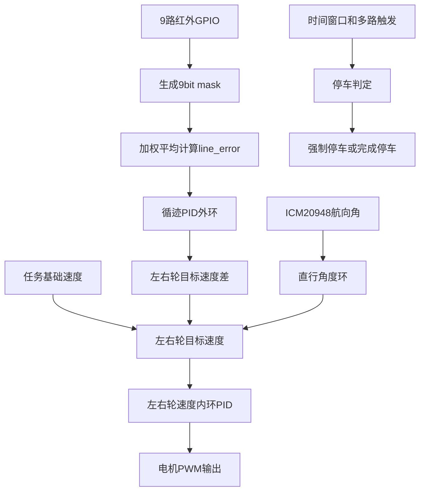
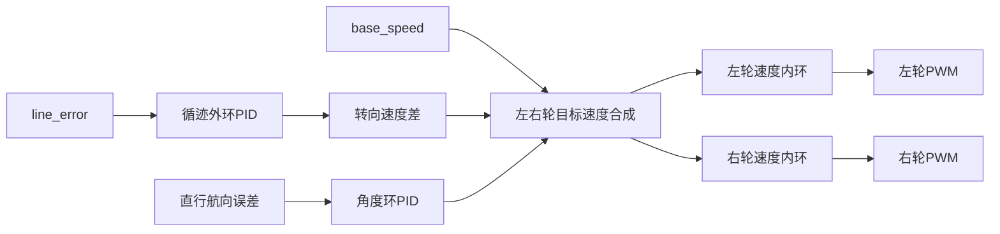

# 循迹模块完整实施方案

本文档是 `DOC/赛题实施方案_循迹与滚球稳定.md` 的循迹子方案，面向任务 2、任务 4、任务 5、任务 6 的红外循迹控制实现。方案基于 9 路红外循迹传感器、ICM20948 姿态信息、电机速度内环 PID，以及按键选择任务后的独立任务状态机。

## 1. 设计目标

循迹模块需要完成以下目标：

1. 读取 9 路红外传感器，得到赛道黑线相对于车体中心的位置偏差。
2. 使用加权平均法计算线位置 `line_error`。
3. 将 `line_error` 输入循迹 PID 外环，输出左右轮目标速度差。
4. 将左右轮目标速度输入电机速度内环 PID，输出电机 PWM。
5. 在直行段加入 ICM20948 角度环，抑制车体航向漂移。
6. 在停车阶段使用“运行时间窗口 + 多路传感器触发 + 强制停车时间”判定，避免刚启动误判和错过终点。
7. 为任务 2、4、5、6 提供统一循迹能力，但每个赛题任务保留独立状态机。

## 2. 与总方案的关系

循迹模块是公共底层模块，不直接决定赛题任务流程。任务状态机调用循迹模块，并根据任务目标决定基础速度、停车条件、是否叠加滚球控制。

| 任务 | 是否使用循迹 | 循迹目标 |
|---|---|---|
| 任务 1 | 否 | 只做图传检查提示 |
| 任务 2 | 是 | A 点启动，一圈回 A 停车 |
| 任务 3 | 否 | 小车静止，只做滚球控制 |
| 任务 4 | 是 | A 点到 B 点，B 点停车 |
| 任务 5 | 是 | 一圈回 A，球保持中心 |
| 任务 6 | 是 | 一圈回 A，球保持预设位置 |

## 3. 建议新增模块

允许新增独立模块，并由用户手动加入 Keil 工程 `USER/WHEELTEC.uvprojx`。为保持工程简洁，循迹部分建议新增两组文件：

| 文件 | 职责 |
|---|---|
| `HARDWARE/track_ir.c` | 9 路红外 GPIO 初始化、读取、掩码生成、线位置计算 |
| `HARDWARE/track_ir.h` | 红外引脚宏、数据结构、函数声明 |
| `BALANCE/track_control.c` | 循迹外环 PID、直行角度环、目标速度生成、停车判定 |
| `BALANCE/track_control.h` | 循迹控制参数、状态结构、接口声明 |

与任务状态机的关系：

| 文件 | 职责 |
|---|---|
| `BALANCE/contest_task.c` | 调用循迹模块，执行任务 2、4、5、6 的状态机 |
| `BALANCE/balance.c` | 在现有周期控制任务中调用 `Contest_Task_Update()` 或 `Track_Control_Update()` |
| `BALANCE/system.c` | 保存全局参数和默认配置 |
| `BALANCE/system.h` | 暴露必要结构和接口 |

## 4. 引脚分配

根据 `DOC/侧边引脚复用.md`，9 路红外循迹信号线使用中央排针。UART4 可让出给循迹 GPIO，当前工程正在使用的 USART1、USART2、UART5 尽量保留。

| 通道 | 建议引脚 | 中央排针位置 | 逻辑位置 | 备注 |
|---|---|---|---|---|
| IR0 | PC11 | 左侧 | 最左 | 原 UART4_RX / USART3_RX 复用，本方案作 GPIO 输入 |
| IR1 | PA7 | 左侧 | 左 4 | 普通输入 |
| IR2 | PC5 | 左侧 | 左 3 | 普通输入 |
| IR3 | PC3 | 左侧 | 左 2 | 普通输入 |
| IR4 | PC2 | 左侧 | 中心 | 普通输入 |
| IR5 | PC1 | 左侧 | 右 2 | 普通输入 |
| IR6 | PC0 | 左侧 | 右 3 | 普通输入 |
| IR7 | PC10 | 右侧 | 右 4 | 原 UART4_TX / USART3_TX 复用，本方案作 GPIO 输入 |
| IR8 | PD15 | 右侧 | 最右 | 普通输入 |

集中宏定义建议：

```c
#define TRACK_IR0_PORT GPIOC
#define TRACK_IR0_PIN  GPIO_Pin_11
#define TRACK_IR1_PORT GPIOA
#define TRACK_IR1_PIN  GPIO_Pin_7
#define TRACK_IR2_PORT GPIOC
#define TRACK_IR2_PIN  GPIO_Pin_5
#define TRACK_IR3_PORT GPIOC
#define TRACK_IR3_PIN  GPIO_Pin_3
#define TRACK_IR4_PORT GPIOC
#define TRACK_IR4_PIN  GPIO_Pin_2
#define TRACK_IR5_PORT GPIOC
#define TRACK_IR5_PIN  GPIO_Pin_1
#define TRACK_IR6_PORT GPIOC
#define TRACK_IR6_PIN  GPIO_Pin_0
#define TRACK_IR7_PORT GPIOC
#define TRACK_IR7_PIN  GPIO_Pin_10
#define TRACK_IR8_PORT GPIOD
#define TRACK_IR8_PIN  GPIO_Pin_15
```

黑线有效电平需要可配置：

```c
#define TRACK_BLACK_LEVEL 0
```

如果实测黑线输出高电平，则改为：

```c
#define TRACK_BLACK_LEVEL 1
```

## 5. 数据流总览



## 6. 红外读取与线位置计算

### 6.1 输入掩码

9 路传感器从左到右编号 IR0 到 IR8，读取后形成 `line_mask`。

建议 bit 对应关系：

| bit | 传感器 | 位置 |
|---|---|---|
| bit0 | IR0 | 最左 |
| bit1 | IR1 | 左 4 |
| bit2 | IR2 | 左 3 |
| bit3 | IR3 | 左 2 |
| bit4 | IR4 | 中心 |
| bit5 | IR5 | 右 2 |
| bit6 | IR6 | 右 3 |
| bit7 | IR7 | 右 4 |
| bit8 | IR8 | 最右 |

`line_mask` 中 bit 为 1 表示检测到黑线。若模块硬件输出与定义相反，在读取阶段统一反相，不要让上层算法关心电平极性。

### 6.2 加权平均

权重建议：

| 通道 | IR0 | IR1 | IR2 | IR3 | IR4 | IR5 | IR6 | IR7 | IR8 |
|---|---|---|---|---|---|---|---|---|---|
| 权重 | -4 | -3 | -2 | -1 | 0 | +1 | +2 | +3 | +4 |

计算方式：

```c
line_error = sum(weight[i] * active[i]) / active_count;
```

其中：

- `line_error < 0`：黑线偏左。
- `line_error = 0`：黑线居中。
- `line_error > 0`：黑线偏右。
- `active_count = 0`：丢线。
- `active_count >= TRACK_CROSS_MIN_COUNT`：可能进入横线、起点、终点、路口特征判断。

### 6.3 建议数据结构

```c
typedef struct
{
    uint16_t raw_mask;
    uint16_t line_mask;
    uint8_t active_count;
    uint8_t line_valid;
    float line_error;
    float last_line_error;
    uint16_t lost_count;
    uint16_t wide_line_count;
} TrackIrState_t;
```

## 7. 循迹控制总体结构

循迹控制采用双环结构：

1. 外环：线位置 PID。
2. 内环：左右轮速度 PID。
3. 直行段辅助环：ICM20948 航向角 PID。



## 8. 外环：循迹 PID

### 8.1 输入输出

| 项 | 含义 |
|---|---|
| 输入 | `line_error` |
| 目标 | `0`，即黑线位于中央 |
| 输出 | `turn_delta_speed`，左右轮速度差 |

外环 PID 公式：

```c
error = 0.0f - line_error;
turn_delta_speed = Kp * error + Ki * integral + Kd * derivative;
```

比赛初期建议先使用 PD，不开积分：

```c
Ki = 0.0f;
```

原因：红外线位置误差不是连续物理量，积分项容易导致弯道后残留偏置。

### 8.2 输出限幅

外环输出需要限幅：

```c
turn_delta_speed = limit(turn_delta_speed, -TRACK_TURN_MAX, TRACK_TURN_MAX);
```

弯道阶段可以适当增大 `TRACK_TURN_MAX`，直行高速阶段应减小。

## 9. 左右轮目标速度合成

假设 `base_speed` 为任务给定基础速度，`turn_delta_speed` 为外环输出。

差速车目标速度合成：

```c
left_target_speed  = base_speed - turn_delta_speed;
right_target_speed = base_speed + turn_delta_speed;
```

如果现场发现转向方向相反，只调整一个方向宏：

```c
#define TRACK_TURN_DIR 1
```

合成时使用：

```c
left_target_speed  = base_speed - TRACK_TURN_DIR * turn_delta_speed;
right_target_speed = base_speed + TRACK_TURN_DIR * turn_delta_speed;
```

### 9.1 速度分级

不同任务使用不同基础速度：

| 场景 | 速度策略 |
|---|---|
| 任务 2 | 可使用较高基础速度，以满足一圈 20s 指标 |
| 任务 4 | AB 段叠加滚球控制，速度应保守 |
| 任务 5 | 整圈球居中，根据球误差动态限速 |
| 任务 6 | 预设位置保持，根据球误差动态限速 |
| 丢线恢复 | 低速搜索 |
| 接近终点 | 减速 |
| 强制停车 | 目标速度为 0 |

## 10. 内环：电机速度 PID

循迹外环只负责生成左右轮目标速度，不直接输出 PWM。PWM 仍由电机速度内环产生。

### 10.1 输入输出

| 项 | 左轮 | 右轮 |
|---|---|---|
| 目标 | `left_target_speed` | `right_target_speed` |
| 反馈 | 左侧编码器速度 | 右侧编码器速度 |
| 输出 | 左轮 PWM | 右轮 PWM |

速度内环公式：

```c
speed_error = target_speed - measured_speed;
pwm = Kp * speed_error + Ki * integral + Kd * derivative;
```

内环可以保留积分项，因为速度闭环是连续物理量。需要做积分限幅和 PWM 限幅。

### 10.2 多电机底盘处理

如果当前车模使用四电机，建议把左右侧电机分组：

| 分组 | 电机 |
|---|---|
| 左轮组 | 左前、左后 |
| 右轮组 | 右前、右后 |

左右目标速度分别复制到同侧两个电机，或按现有底盘运动学接口转换。

## 11. 直行段 ICM20948 角度环

### 11.1 加入原因

红外传感器只能看到车体相对黑线的位置，不能直接约束车体航向。直行段如果只靠线位置误差，可能出现蛇形摆动。因此在直行段增加 ICM20948 航向角环。

### 11.2 启用条件

角度环不应全程强制启用，建议只在直行段启用：

1. `abs(line_error)` 较小。
2. `active_count` 接近中心线常规宽度。
3. 最近一段时间没有出现大弯道或宽线特征。
4. 任务状态处于 `TRACKING`，不处于丢线、终点识别、强制停车。

示例条件：

```c
straight_enable = line_valid && abs(line_error) <= TRACK_STRAIGHT_ERR_TH && active_count <= TRACK_STRAIGHT_WIDTH_TH;
```

### 11.3 角度参考

进入直行段时记录当前 ICM20948 航向角作为 `yaw_ref`：

```c
yaw_ref = current_yaw;
```

直行段角度误差：

```c
yaw_error = yaw_ref - current_yaw;
```

角度环输出：

```c
yaw_delta_speed = Kyaw_p * yaw_error + Kyaw_d * yaw_error_diff;
```

叠加到左右目标速度：

```c
left_target_speed  -= yaw_delta_speed;
right_target_speed += yaw_delta_speed;
```

如果现场发现方向反了，只调整 `TRACK_YAW_DIR`。

### 11.4 弯道退出

当 `abs(line_error)` 变大、左右边缘传感器触发、或 `active_count` 异常变宽时，认为进入弯道或标志线，暂停角度环，由红外循迹外环主导。

## 12. 丢线处理

丢线定义：

```c
active_count == 0
```

处理策略：

| 丢线时间 | 行为 |
|---|---|
| 短时间 | 按 `last_line_error` 方向低速搜索 |
| 中等时间 | 进一步降速，限制 PWM |
| 超时 | 保护停车，状态机进入异常 |

搜索方向：

```c
if (last_line_error > 0)
{
    // 最后一次线在右侧，向右找线
}
else
{
    // 最后一次线在左侧，向左找线
}
```

任务 4、5、6 叠加滚球控制时，丢线建议更保守：短暂丢线即可降速，长时间丢线直接停车，避免滚球失稳。

## 13. 宽线与 A/B 点识别

停车判定不直接使用普通 `line_error`，而是单独识别“多路传感器同时检测到信号”的宽线特征。

### 13.1 宽线特征

建议条件：

```c
wide_line_detected = active_count >= TRACK_WIDE_COUNT_TH;
```

例如：

```c
#define TRACK_WIDE_COUNT_TH 5
```

为了防止毛刺，应要求连续多周期满足：

```c
wide_line_count >= TRACK_WIDE_STABLE_COUNT
```

### 13.2 起点误判屏蔽

由于小车从 A 点启动，启动瞬间就可能检测到 A 点宽线。因此任务 2、5、6 必须设置起点屏蔽时间或屏蔽距离。

示例：

```c
if (run_time_ms < TRACK_A_IGNORE_TIME_MS)
{
    ignore_a_marker = 1;
}
```

只有超过屏蔽时间后，宽线才允许作为回到 A 点候选。

## 14. 停车逻辑

用户指定停车逻辑为：

1. 运行时间在某个区间内时，多路传感器检测到信号。
2. 当运行到某个时间时，强制停车。

因此停车判定分为“特征停车”和“强制停车”。

### 14.1 特征停车

在允许停车的时间窗口内，检测到宽线特征，进入减速停车。

```c
if (run_time_ms >= stop_window_start_ms &&
    run_time_ms <= stop_window_end_ms &&
    wide_line_stable)
{
    track_stop_request = 1;
    stop_reason = TRACK_STOP_BY_MARKER;
}
```

### 14.2 强制停车

如果超过强制停车时间，无论是否识别到宽线，都直接停车，防止冲出赛区或超时。

```c
if (run_time_ms >= force_stop_ms)
{
    track_stop_request = 1;
    stop_reason = TRACK_STOP_BY_TIMEOUT;
}
```

### 14.3 任务参数建议

不同任务使用不同停车参数：

| 任务 | 停车目标 | 参数特点 |
|---|---|---|
| 任务 2 | 回 A 点停车 | 时间窗口应覆盖一圈预计到达时间，强制时间小于或接近 20s 指标 |
| 任务 4 | 到 B 点停车 | 时间窗口覆盖 AB 段预计到达时间，强制时间小于或接近 8s 指标 |
| 任务 5 | 回 A 点停车 | 时间窗口覆盖一圈预计到达时间，强制时间小于或接近 30s 指标 |
| 任务 6 | 回 A 点停车 | 同任务 5，但基础速度可能更低 |

参数应做成结构体，由任务状态机传入循迹模块。

## 15. 建议状态结构

### 15.1 循迹 PID

```c
typedef struct
{
    float kp;
    float ki;
    float kd;
    float integral;
    float last_error;
    float output;
    float output_limit;
} TrackPid_t;
```

### 15.2 循迹控制状态

```c
typedef struct
{
    uint8_t enable;
    uint8_t straight_yaw_enable;
    uint8_t stop_request;
    uint8_t stop_reason;

    float base_speed;
    float turn_delta_speed;
    float yaw_delta_speed;
    float left_target_speed;
    float right_target_speed;

    float yaw_ref;
    float yaw_error;

    uint32_t run_time_ms;
    uint32_t stop_window_start_ms;
    uint32_t stop_window_end_ms;
    uint32_t force_stop_ms;

    TrackPid_t line_pid;
    TrackPid_t yaw_pid;
} TrackControlState_t;
```

### 15.3 停车原因

```c
typedef enum
{
    TRACK_STOP_NONE = 0,
    TRACK_STOP_BY_MARKER,
    TRACK_STOP_BY_TIMEOUT,
    TRACK_STOP_BY_LOST_LINE,
    TRACK_STOP_BY_USER,
} TrackStopReason_t;
```

## 16. 控制周期

建议循迹控制与现有主控制周期保持一致，优先使用 100Hz。

周期内执行顺序：

1. 读取 9 路红外。
2. 计算 `line_mask`、`line_error`、`active_count`。
3. 更新宽线、丢线、停车判定。
4. 若停车请求成立，目标速度置 0。
5. 若未停车，运行循迹外环 PID。
6. 若满足直行条件，运行 ICM20948 角度环。
7. 合成左右目标速度。
8. 交给电机速度内环。
9. 输出 PWM。

## 17. 任务状态机调用方式

任务状态机不直接处理红外细节，只设置循迹模式和参数。

### 17.1 任务 2 调用

```c
Track_Control_Start(TRACK_MODE_LAP_A, base_speed_task2);
Track_Control_SetStopWindow(t2_start_ms, t2_end_ms, t2_force_ms);
```

任务 2 状态机只关心：

- 是否完成停车。
- 是否丢线失败。
- 总时间显示。

### 17.2 任务 4 调用

```c
Track_Control_Start(TRACK_MODE_AB, base_speed_task4);
Track_Control_SetStopWindow(t4_start_ms, t4_end_ms, t4_force_ms);
```

任务 4 同时运行滚球居中控制，若球误差过大，降低 `base_speed`。

### 17.3 任务 5 / 任务 6 调用

任务 5 和任务 6 使用一圈停车逻辑，区别在于滚球目标不同。

```c
Track_Control_Start(TRACK_MODE_LAP_A, base_speed_task5_or_task6);
Track_Control_SetStopWindow(lap_start_ms, lap_end_ms, lap_force_ms);
```

## 18. 与滚球控制的速度联动

任务 4、5、6 中，如果滚球误差变大，应降低循迹基础速度。

示例策略：

| 球位置误差 | 速度处理 |
|---|---|
| 小于 0.5cm | 使用正常基础速度 |
| 0.5cm 到 1cm | 适当降速 |
| 大于 1cm | 明显降速或短暂停车保护 |
| 丢球 | 停车保护 |

速度调整不应直接改变外环 PID 参数，而是改变 `base_speed` 和最大转向输出。

## 19. 调试步骤

### 19.1 红外输入调试

1. 单独显示 `line_mask`。
2. 手动让每一路传感器压黑线，确认 bit 顺序从 IR0 到 IR8 正确。
3. 确认 `TRACK_BLACK_LEVEL` 是否正确。
4. 确认中心传感器触发时 `line_error` 接近 0。
5. 确认黑线在左侧时 `line_error < 0`，黑线在右侧时 `line_error > 0`。

### 19.2 外环调试

1. 先低速，只开 P。
2. 若转弯不足，增大 `line_pid.kp`。
3. 若来回摆动，减小 `line_pid.kp` 或增加 `line_pid.kd`。
4. 初期保持 `line_pid.ki = 0`。
5. 确认转向方向，必要时修改 `TRACK_TURN_DIR`。

### 19.3 内环调试

1. 先固定左右目标速度，确认左右轮速度反馈方向。
2. 确认目标速度为正时小车前进。
3. 调整速度内环 PID，使左右轮能稳定跟随目标速度。
4. 再接入循迹外环。

### 19.4 角度环调试

1. 先不开角度环，完成基本循迹。
2. 在直行段启用角度环。
3. 小幅调整 `yaw_pid.kp`，观察是否减小蛇形。
4. 若弯道抗拒转弯，说明角度环启用条件过宽，应缩小直行判定范围。
5. 确认方向，必要时修改 `TRACK_YAW_DIR`。

### 19.5 停车调试

1. 先显示 `run_time_ms` 和 `active_count`。
2. 记录一圈回 A 或 AB 段到 B 的典型时间。
3. 设置 `stop_window_start_ms` 略早于典型到达时间。
4. 设置 `stop_window_end_ms` 略晚于典型到达时间。
5. 设置 `force_stop_ms` 作为最终保护。
6. 确认启动初期 A 点不会误判。

## 20. 参数建议初值

以下只作为现场调试起点，实际参数需要按车速、底盘、电机和传感器高度调整。

| 参数 | 建议初值 | 说明 |
|---|---|---|
| `TRACK_BLACK_LEVEL` | 0 | 需实测确认 |
| `TRACK_WIDE_COUNT_TH` | 5 | 多路触发判为宽线候选 |
| `TRACK_WIDE_STABLE_COUNT` | 3 到 5 | 连续周期防抖 |
| `TRACK_LOST_STOP_COUNT` | 20 到 50 | 100Hz 下约 0.2s 到 0.5s |
| `line_pid.ki` | 0 | 初期不开积分 |
| `line_pid.kd` | 小量 | 用于抑制摆动 |
| `yaw_pid.ki` | 0 | 角度环不建议积分 |
| `TRACK_STRAIGHT_ERR_TH` | 0.5 到 1.0 | 线误差小才启用角度环 |

## 21. 实施清单

1. 新增 `HARDWARE/track_ir.h`，定义 9 路红外引脚、黑线电平、数据结构和接口。
2. 新增 `HARDWARE/track_ir.c`，实现 GPIO 初始化、9 路读取、`line_mask` 和 `line_error` 计算。
3. 新增 `BALANCE/track_control.h`，定义循迹 PID、控制状态、停车参数和接口。
4. 新增 `BALANCE/track_control.c`，实现循迹外环 PID、直行角度环、左右目标速度合成、停车判定。
5. 在 `BALANCE/system.c` 初始化阶段调用红外初始化函数。
6. 在 `BALANCE/contest_task.c` 的任务 2、4、5、6 状态机中调用循迹控制接口。
7. 在现有周期控制任务中保证循迹控制按 100Hz 左右调用。
8. 用户手动将新增 `.c` 文件加入 Keil 工程 `USER/WHEELTEC.uvprojx`。
9. Keil 编译并修复接口声明问题。
10. 按“红外输入 -> 外环 -> 内环 -> 角度环 -> 停车判定”的顺序逐项调试。

## 22. 结论

循迹模块采用“红外线位置外环 + 电机速度内环 + 直行 ICM20948 角度环 + 时间窗口停车”的结构。红外模块只负责感知，循迹控制只负责生成目标速度，电机速度内环负责 PWM 输出，任务状态机负责何时启动、何时停车、何时进入异常保护。这样的分层能保证任务 2、4、5、6 复用同一套循迹能力，同时保持每个赛题任务状态机独立、简洁、易调试。

当前工程有 PID / PI 算法基础，但没有适合后续多控制环复用的通用 PID 模块。

- 电机速度内环已有增量式 PI，可继续作为电机速度内环参考和复用，位置在 [`BALANCE/balance.c`](BALANCE/balance.c:435)。
- 电机参数结构 [`Motor_parameter`](BALANCE/system.h:53) 只适合电机语义，不适合作为通用 PID 结构体。
- CCD / 电磁巡线已有类似 PD 的控制逻辑，可作为 9 路红外循迹外环的算法参考，但不建议直接复用其变量命名，因为旧代码中 [`CCD_KI`](BALANCE/system.h:92) / [`ELE_KI`](BALANCE/system.h:93) 实际更像 D 项。
- 雷达走直线和跟随控制已有位置式 PID，例如 [`Along_Adjust_PID()`](BALANCE/balance.h:106)、[`Distance_Adjust_PID()`](BALANCE/balance.h:107)、[`Follow_Turn_PID()`](BALANCE/balance.h:108)，实现位于 [`BALANCE/balance.c`](BALANCE/balance.c:1185)，但这些函数使用 `static` 局部状态和全局参数，不适合同时复用于循迹外环、ICM20948 角度环、滚球 PID 等多个控制实例。

后续建议：保留现有速度 PI 作为电机内环；另外新增轻量通用 PID 模块，例如 [`BALANCE/pid_controller.c`](BALANCE/pid_controller.c) / [`BALANCE/pid_controller.h`](BALANCE/pid_controller.h)，定义独立 `PidController_t`，供循迹外环、直行角度环、滚球位置环分别创建独立 PID 实例使用。
