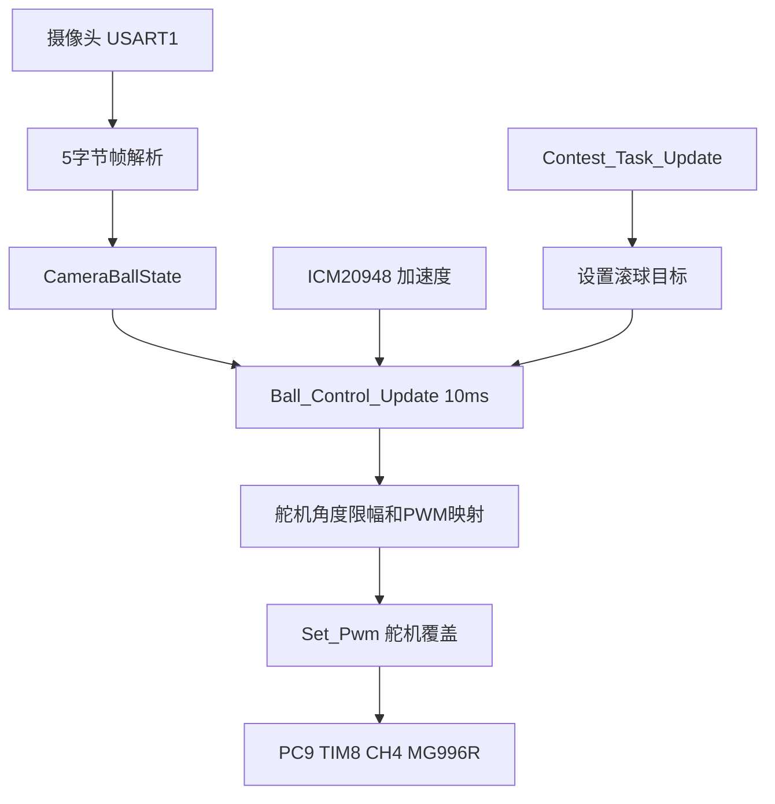
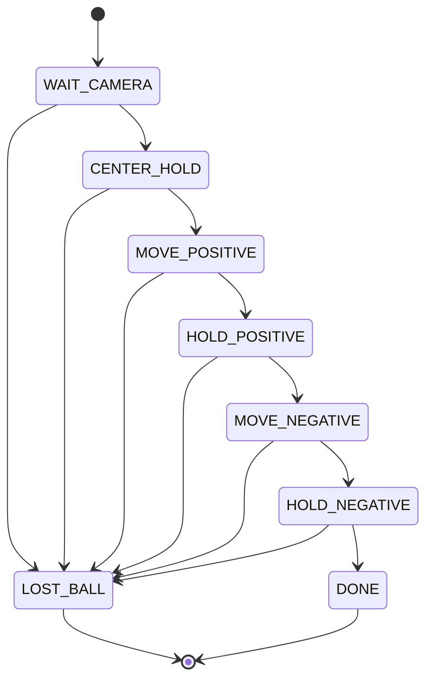
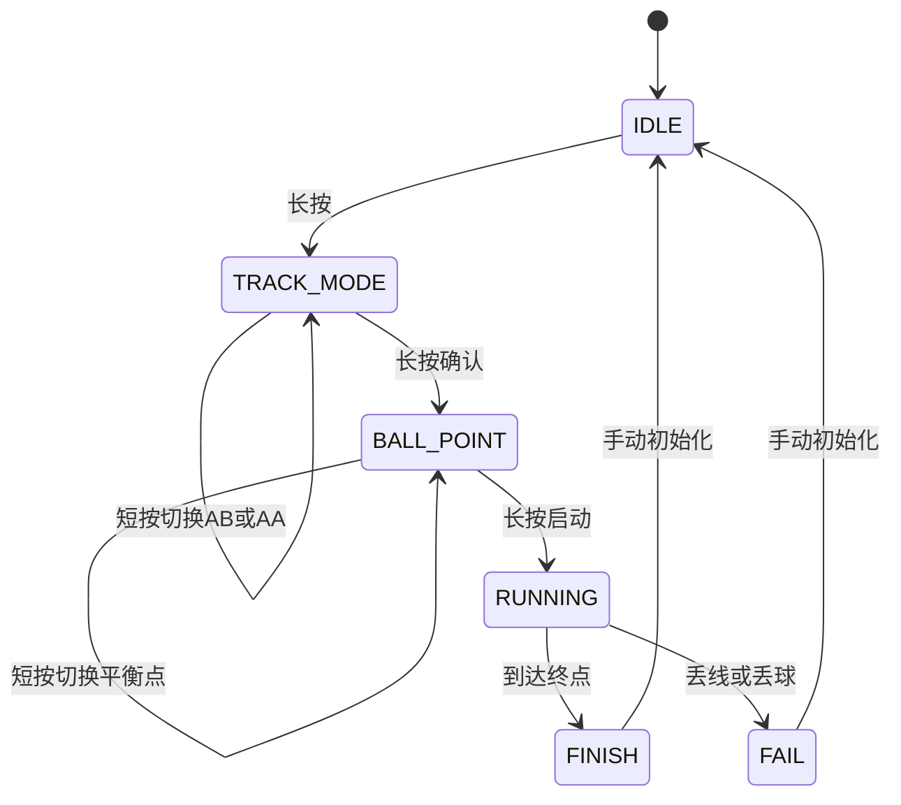

# 滚球稳定模块实施方案

本文档面向当前 STM32F4 / Keil / FreeRTOS 工程，给出第二个子模块“滚球稳定”的详细实施方案。方案依据 `DOC/赛题实施方案_循迹与滚球稳定.md` 中的任务拆分与外设分配，以及 `DOC/舵机控制方案_v0.1.md` 中的 MG996R 舵机控制思路制定。

本轮实现边界如下：

1. 以任务 3 静态滚球稳定为第一落地点。
2. 同时预留任务 4、任务 5、任务 6 的循迹联动接口。
3. 摄像头通过 USART1 接入，协议沿用 5 字节定长帧：`AA CMD DATA_H DATA_L BB`。
4. 位置单位为 0.1mm。
5. 摄像头位置正方向定义为：钢球位于画面或轨道右侧时为正。
6. 舵机执行机构为 MG996R，利用其内部位置闭环；STM32 不设计舵机角度内环，只输出目标 PWM。

---

## 1. 当前工程接口与资源匹配

### 1.1 周期调度

当前核心控制任务 `Balance_task()` 以 100Hz 运行，即 10ms 一次控制周期。该周期与舵机控制方案中推荐的 10ms 滚球控制周期一致。

现有调度关系：

```text
Balance_task 100Hz
    -> Get_Velocity_Form_Encoder
    -> Contest_Task_Update CONTEST_TRACK_PERIOD_MS
    -> KEY_Scan
    -> Contest_Task_KeyAction
    -> 电机速度 PI
    -> Set_Pwm
```

因此滚球稳定模块不建议新增 FreeRTOS 任务，而应接入 `Contest_Task_Update()` 的 10ms 周期内统一调度。这样可以避免跨任务同步问题，也便于后续任务 4、5、6 与循迹控制共享同一个安全输出节拍。

### 1.2 舵机 PWM

当前工程已经使用 PC9 / TIM8 CH4 作为舵机 PWM 输出：

- 初始化函数：`TIM8_SERVO_Init(9999, 168 - 1)`。
- PWM 输出宏：`Servo_PWM`，即 `TIM8->CCR4`。
- 定时器频率：100Hz。
- 周期：10ms。
- 计数单位：约 1us。

这意味着 MG996R 的典型 500us 到 2500us PWM 可以直接写入 `TIM8->CCR4`。

需要注意：当前差速车分支调用 `Set_Pwm()` 时传入舵机参数为 0，因此如果滚球模块直接写 `Servo_PWM`，后续仍可能被 `Set_Pwm()` 覆盖为 0。实施时应在 `Set_Pwm()` 的舵机输出处加入“滚球模块输出覆盖”逻辑。

推荐策略：

```text
if Ball_Control 已启用
    Servo_PWM = Ball_Control 输出 PWM
else
    Servo_PWM = servo 参数
```

这样既不破坏旧阿克曼车逻辑，也能保证赛题差速车模式下舵机由滚球模块接管。

### 1.3 摄像头串口

USART1 已初始化为 115200，PA10 为 RX，PA9 为 TX。当前 `USART1_IRQHandler()` 只读取并丢弃接收字节，因此适合改造成摄像头协议解析入口。

建议保持中断内逻辑轻量：

1. 只做逐字节状态机解析。
2. 收到完整帧后更新全局摄像头状态。
3. 不在中断里做 PID、滤波、OLED 显示等耗时工作。

### 1.4 IMU 加速度

工程中 ICM20948 已有加速度读取接口：

- `ICM20948_Get_Accel()` 更新 `imu.accel.x/y/z`。
- 从现有处理可见，静止重力约为 16384 LSB，对应 1g。

滚球模块可以在 10ms 周期内调用 `ICM20948_Get_Accel()`，选取与小车前后运动方向一致的轴作为扰动前馈来源。

由于 IMU 安装方向可能与实际轨道方向不一致，建议通过宏定义选择前馈轴和符号：

```c
#define BALL_IMU_ACCEL_AXIS_X      0
#define BALL_IMU_ACCEL_AXIS_Y      1
#define BALL_IMU_ACCEL_AXIS_Z      2
#define BALL_IMU_FF_AXIS           BALL_IMU_ACCEL_AXIS_X
#define BALL_IMU_FF_SIGN           1.0f
```

任务 3 静态调试阶段建议先将前馈系数 `kf` 置 0，等静态 PID 调通后，在任务 4、5、6 移动联调时再打开前馈。

---

## 2. 总体软件架构

建议新增一组独立滚球控制模块，并复用已有串口、IMU、舵机和任务状态机。

| 模块 | 文件 | 职责 |
|---|---|---|
| 摄像头解析 | `HARDWARE/usartx.c` / `HARDWARE/usartx.h` | USART1 中断解析 5 字节帧，维护球位置、在线、丢球、心跳、帧错误 |
| 滚球控制 | `BALANCE/ball_control.c` / `BALANCE/ball_control.h` | 视觉滤波、位置 PID、IMU 前馈、舵机限幅、死区、变化率限制、稳定判据 |
| 任务状态机 | `BALANCE/contest_task.c` / `BALANCE/contest_task.h` | 增加任务 3 状态机，预留任务 4-6 的滚球联动调用 |
| 系统聚合 | `BALANCE/system.c` / `BALANCE/system.h` | include 新模块并在系统初始化中初始化滚球控制 |
| 舵机输出覆盖 | `BALANCE/balance.c` | 在 `Set_Pwm()` 中让滚球模块可覆盖差速车传入的舵机 0 值 |

总体数据流：



---

## 3. 摄像头协议与状态设计

### 3.1 协议格式

摄像头发送定长 5 字节帧，无校验：

| 字节偏移 | 含义 | 说明 |
|---:|---|---|
| 0 | 帧头 | 固定 `0xAA` |
| 1 | 命令 | `0x01` 位置，`0x02` 丢球，`0x03` 心跳 |
| 2 | 数据高 8 位 | `(data >> 8) & 0xFF` |
| 3 | 数据低 8 位 | `data & 0xFF` |
| 4 | 帧尾 | 固定 `0xBB` |

位置数据为 `int16_t`，单位 0.1mm。

示例：

| 实际位置 | 数据值 | 帧 |
|---|---:|---|
| 右侧 5cm | +500 | `AA 01 01 F4 BB` |
| 左侧 5cm | -500 | `AA 01 FE 0C BB` |
| 丢球 | 无需位置 | `AA 02 00 00 BB` |
| 心跳 | 可为 0 | `AA 03 00 00 BB` |

### 3.2 中断解析策略

`USART1_IRQHandler()` 中使用状态机：

1. 等待 `0xAA`。
2. 读取命令字。
3. 读取数据高字节。
4. 读取数据低字节。
5. 检查帧尾 `0xBB`。
6. 帧尾正确则处理命令。
7. 帧尾错误则增加错误计数并回到等待帧头。

中断只更新摄像头状态，不直接调用滚球 PID。

### 3.3 摄像头状态结构

建议在 `HARDWARE/usartx.h` 中声明：

```c
typedef struct
{
    int16_t raw_pos_0p1mm;
    uint8_t online;
    uint8_t ball_lost;
    uint8_t new_sample;
    uint16_t heartbeat;
    uint32_t last_update_tick;
    uint16_t frame_error_count;
} CameraBallState_t;
```

字段含义：

| 字段 | 含义 |
|---|---|
| `raw_pos_0p1mm` | 最新有效位置，单位 0.1mm |
| `online` | 收到位置帧或心跳后置 1 |
| `ball_lost` | 收到丢球帧或超时后置 1 |
| `new_sample` | 收到新位置帧后置 1，主循环消费后可清零 |
| `heartbeat` | 心跳累计计数 |
| `last_update_tick` | 最后一次收到位置或心跳的系统 tick |
| `frame_error_count` | 帧尾错误、非法命令等错误计数 |

推荐接口：

```c
void Camera_Ball_ParseByte(uint8_t byte);
void Camera_Ball_GetState(CameraBallState_t *state);
void Camera_Ball_ClearNewSample(void);
uint8_t Camera_Ball_IsTimeout(uint32_t now_tick, uint32_t timeout_ms);
```

其中 `now_tick` 建议使用工程已有 tick 获取函数，超时阈值初始可取 100ms 到 200ms。

---

## 4. 滚球控制算法设计

### 4.1 控制目标

滚球控制目标为让钢球位置 `x` 跟踪任务给定目标 `x_ref`。

误差定义：

```text
e = x_ref - x_filtered
```

其中：

- `x_ref` 单位为 0.1mm。
- `x_filtered` 为摄像头位置低通滤波结果，单位为 0.1mm。
- PID 输出为目标轨道倾角，单位为 degree。

### 4.2 视觉滤波

使用一阶低通：

```text
x_filtered(k) = alpha * x_raw(k) + (1 - alpha) * x_filtered(k - 1)
```

初始建议：

```c
alpha = 0.25f;
```

首次收到有效位置时，直接令 `x_filtered = x_raw`，防止滤波初值为 0 导致舵机误动作。

丢球时不更新滤波，不继续积分，避免用错误数据驱动舵机。

### 4.3 PID 输出

离散 PID：

```text
angle_pid = kp * e + ki * integral + kd * de
```

其中：

```text
integral += e * dt
de = (e - last_e) / dt
```

考虑本工程位置单位为 0.1mm，参数不能直接使用舵机文档中的 `Kp = 5`。舵机文档参数更接近 cm 或归一化输入，本工程 5cm 对应误差 500，如果直接乘 5 会得到 2500deg，必然饱和。

推荐初始参数：

| 参数 | 初始值 | 说明 |
|---|---:|---|
| `kp` | 0.010f | 5cm 误差输出约 5deg |
| `ki` | 0.000f | 初期关闭积分 |
| `kd` | 0.020f | 抑制过冲，需根据视觉噪声调 |
| `integral_limit` | 3000.0f | 防止积分累积 |
| `angle_limit_deg` | 25.0f | 舵机方案机械限幅 |

调参顺序：

1. `ki = 0`，`kd = 0`，只调 `kp`。
2. 球能回目标但过冲时增加 `kd`。
3. 静态存在不可接受偏差时再加很小 `ki`。
4. 移动任务再启用 IMU 前馈。

### 4.4 IMU 加速度前馈

根据舵机方案：

```text
theta_ff = Kf * ax / g
```

在本工程可采用：

```text
acc_g = selected_accel_axis / 16384.0f
theta_ff_deg = kf * acc_g
```

这里 `kf` 可直接理解为 1g 加速度对应的补偿角度，单位 degree。

初始建议：

| 阶段 | `kf` |
|---|---:|
| 任务 3 静态调试 | 0.0f |
| 任务 4-6 初次移动联调 | 3.0f 到 8.0f |

前馈方向可能需要实车确认，建议通过 `BALL_IMU_FF_SIGN` 一键反向。

### 4.5 输出合成与保护

最终倾角：

```text
theta = theta_pid + theta_ff
```

保护流程：

1. 倾角限幅：限制到 ±25deg。
2. 死区处理：绝对值小于 1.0deg 到 1.5deg 时可置 0，减少舵机抖动。
3. 变化率限制：每 10ms 最大变化 2deg，避免快速摆动。
4. PWM 映射：从目标倾角映射到 MG996R PWM。
5. PWM 限幅：先保守限制在 1000us 到 2000us，机械确认后再扩大。

---

## 5. 舵机 PWM 映射

MG996R 典型映射：

| 舵机角度 | PWM |
|---:|---:|
| 0deg | 500us |
| 90deg | 1500us |
| 180deg | 2500us |

本项目定义摆杆水平为中位：

```text
servo_pwm = servo_mid_us + output_angle_deg * us_per_degree * servo_dir
```

推荐初始参数：

| 参数 | 初值 | 说明 |
|---|---:|---|
| `servo_mid_us` | 1500 | 机械水平中位，必须实测校准 |
| `servo_min_us` | 1000 | 初期保守限幅 |
| `servo_max_us` | 2000 | 初期保守限幅 |
| `us_per_degree` | 11.11 | 2000us / 180deg |
| `servo_dir` | 1 或 -1 | 舵机方向，实车确认 |
| `deadband_deg` | 1.0 到 1.5 | 死区 |
| `rate_limit_deg` | 2.0 | 每 10ms 最大角度变化 |

注意：因为 `TIM8_SERVO_Init(9999, 168 - 1)` 对应 100Hz，`TIM8->CCR4 = 1500` 代表约 1500us 高电平，而不是 20ms 舵机周期。MG996R 通常可接受 50Hz 到 100Hz，若实测发热或抖动明显，再评估是否改为 50Hz；但当前方案优先不改定时器资源配置。

---

## 6. 滚球控制模块数据结构与接口

### 6.1 参数结构

建议在 `BALANCE/ball_control.h` 定义：

```c
typedef struct
{
    float alpha;
    float kp;
    float ki;
    float kd;
    float kf;
    float integral_limit;
    float angle_limit_deg;
    float deadband_deg;
    float rate_limit_deg;
    float servo_mid_us;
    float servo_min_us;
    float servo_max_us;
    float us_per_degree;
    float servo_dir;
    uint16_t vision_timeout_ms;
    uint16_t stable_error_0p1mm;
    uint16_t stable_speed_0p1mm_per_s;
    uint16_t stable_count_required;
} BallControlParam_t;
```

### 6.2 状态结构

```c
typedef struct
{
    uint8_t enabled;
    uint8_t online;
    uint8_t ball_lost;
    uint8_t filter_inited;
    int16_t raw_pos_0p1mm;
    float filtered_pos_0p1mm;
    float target_pos_0p1mm;
    float error_0p1mm;
    float last_error_0p1mm;
    float position_speed_0p1mm_per_s;
    float integral;
    float pid_angle_deg;
    float ff_angle_deg;
    float target_angle_deg;
    float output_angle_deg;
    uint16_t output_pwm_us;
    uint16_t stable_count;
    uint16_t lost_count;
    uint16_t safe_mode;
} BallControlState_t;
```

### 6.3 对外接口

建议接口如下：

```c
void Ball_Control_Init(void);
void Ball_Control_Enable(uint8_t enable);
void Ball_Control_Reset(void);
void Ball_Control_SetTarget(float target_0p1mm);
void Ball_Control_Update(uint16_t period_ms);
void Ball_Control_StopSafe(void);
uint8_t Ball_Control_IsStable(void);
uint8_t Ball_Control_IsLost(void);
float Ball_Control_GetAbsError(void);
uint16_t Ball_Control_GetServoPwm(void);
uint8_t Ball_Control_IsServoOverrideEnabled(void);
```

接口职责：

| 接口 | 职责 |
|---|---|
| `Ball_Control_Init` | 设置默认参数、中位 PWM、清状态 |
| `Ball_Control_Enable` | 任务启动时使能，任务结束时关闭 |
| `Ball_Control_Reset` | 清 PID、滤波、稳定计数 |
| `Ball_Control_SetTarget` | 设置目标位置，任务 3 用 0、+500、-500 |
| `Ball_Control_Update` | 每 10ms 调用，完成滤波、PID、前馈、映射 |
| `Ball_Control_StopSafe` | 丢球或停止时缓慢回中 |
| `Ball_Control_IsStable` | 判断是否满足稳定条件 |
| `Ball_Control_IsLost` | 判断视觉丢失或超时 |
| `Ball_Control_GetAbsError` | 给任务 4-6 动态降速使用 |
| `Ball_Control_GetServoPwm` | 输出最终 PWM |
| `Ball_Control_IsServoOverrideEnabled` | 供 `Set_Pwm()` 判断是否覆盖舵机输出 |

---

## 7. 任务 3 状态机设计

### 7.1 任务 3 目标

任务 3 要求小车静止时控制钢球：

1. 先稳定在中心。
2. 移动到 +5cm 并稳定。
3. 移动到 -5cm 并稳定。
4. 完成后停车并显示时间或状态。

位置目标：

| 阶段 | 目标位置 |
|---|---:|
| 中心 | 0 |
| +5cm | +500 |
| -5cm | -500 |

### 7.2 phase 定义

建议给 `ContestTaskContext_t` 增加 `task3_phase` 字段，并定义：

```c
#define CONTEST_TASK3_PHASE_IDLE            0
#define CONTEST_TASK3_PHASE_WAIT_CAMERA     1
#define CONTEST_TASK3_PHASE_CENTER_HOLD     2
#define CONTEST_TASK3_PHASE_MOVE_POSITIVE   3
#define CONTEST_TASK3_PHASE_HOLD_POSITIVE   4
#define CONTEST_TASK3_PHASE_MOVE_NEGATIVE   5
#define CONTEST_TASK3_PHASE_HOLD_NEGATIVE   6
#define CONTEST_TASK3_PHASE_DONE            7
#define CONTEST_TASK3_PHASE_LOST_BALL       8
```

### 7.3 状态转移



### 7.4 各阶段动作

| phase | 动作 | 转移条件 |
|---|---|---|
| `WAIT_CAMERA` | 电机目标清零，舵机中位或安全启用，等待视觉在线 | 摄像头在线且未丢球 |
| `CENTER_HOLD` | `Ball_Control_SetTarget(0)`，启用闭环 | `Ball_Control_IsStable()` |
| `MOVE_POSITIVE` | `Ball_Control_SetTarget(500)` | `Ball_Control_IsStable()` |
| `HOLD_POSITIVE` | 继续保持 +500，可用 phase_time 计保持 | 保持计数达标 |
| `MOVE_NEGATIVE` | `Ball_Control_SetTarget(-500)` | `Ball_Control_IsStable()` |
| `HOLD_NEGATIVE` | 继续保持 -500，可用 phase_time 计保持 | 保持计数达标 |
| `DONE` | 记录完成时间，电机停止，舵机安全保持或回中 | 回菜单或完成显示 |
| `LOST_BALL` | 电机停止，舵机缓慢回中，记录失败状态 | 回菜单或等待重新启动 |

### 7.5 稳定判据

建议统一使用 `Ball_Control_IsStable()`：

1. 绝对误差小于等于 100，即 1cm。
2. 连续满足若干周期，初始可取 50 次。
3. 位置速度低于阈值，防止刚穿过目标点就误判稳定。

推荐初始参数：

| 参数 | 初值 | 说明 |
|---|---:|---|
| `stable_error_0p1mm` | 100 | 1cm |
| `stable_count_required` | 50 | 连续 50 个 10ms 周期 |
| `stable_speed_0p1mm_per_s` | 300 | 每秒 30mm，可调 |
| `vision_timeout_ms` | 200 | 摄像头超时保护 |

---

## 8. 任务 4-6 合并后的通用运行框架

任务 4、任务 5、任务 6 与任务 3 的关系应重新划分：

1. 任务 3 独立实现，只负责静态滚球稳定流程。
2. 任务 4、任务 5、任务 6 不再分别写三套高度相似的状态机。
3. 任务 4、任务 5、任务 6 合并为一个“循迹 + 滚球保持”的通用运行框架。
4. 通用运行框架启动前先配置两个参数：循迹模式和平衡点。
5. 平衡点为 -12 到 +12 之间的整数，单位建议定义为 cm，内部换算为 0.1mm。

这样可以避免任务 4、任务 5、任务 6 中重复处理循迹、滚球目标、丢球保护、动态降速和 OLED 显示。

### 8.1 合并后的任务语义

| 原任务 | 合并后配置 | 等价行为 |
|---|---|---|
| 任务 4 | 循迹模式选择 AB，平衡点选择 0 | A 点到 B 点，球保持中心 |
| 任务 5 | 循迹模式选择 AA，平衡点选择 0 | A 点绕行一圈回 A，球保持中心 |
| 任务 6 | 循迹模式选择 AA，平衡点选择 -12 到 +12 的任意整数 | A 点绕行一圈回 A，球保持指定位置 |

说明：原任务 6 文档中曾考虑“启动前捕获当前球位置作为目标”，本次调整为通过菜单显式选择整数平衡点，范围 -12 到 +12。这样更可控，也便于 OLED 显示和现场复现。

### 8.2 平衡点单位

菜单中显示和选择的平衡点使用整数 cm：

```text
balance_point_cm = -12 到 +12
```

滚球模块内部仍使用 0.1mm，因此换算关系为：

```text
target_0p1mm = balance_point_cm * 100
```

示例：

| 菜单值 | 实际位置 | 内部目标值 |
|---:|---:|---:|
| -12 | -12cm | -1200 |
| -5 | -5cm | -500 |
| 0 | 0cm | 0 |
| +5 | +5cm | +500 |
| +12 | +12cm | +1200 |

### 8.3 循迹模式定义

建议定义简洁枚举：

```c
#define CONTEST_TRACK_SELECT_AB       0
#define CONTEST_TRACK_SELECT_AA       1
```

含义：

| 模式 | 含义 | 对应循迹控制 |
|---|---|---|
| `CONTEST_TRACK_SELECT_AB` | A 点到 B 点直线或指定 AB 段 | 可映射到 `TRACK_MODE_AB` |
| `CONTEST_TRACK_SELECT_AA` | A 点出发绕行一圈回 A | 可映射到 `TRACK_MODE_LAP_A` 或现有任务 2 的一圈策略 |

具体映射取决于第一子模块中已经调通的循迹接口。实现时优先复用现有 `Track_Control_Start()` 和 `Track_Control_SetStopParam()`，不要为 AB 和 AA 重写底层循迹算法。

### 8.4 按键交互状态机

用户交互保持简单，符合现场比赛使用习惯：

1. 在主菜单短按选择到合并后的任务入口。
2. 长按进入循迹模式选择界面。
3. 在循迹模式选择界面短按切换 AB / AA。
4. 长按确认循迹模式，并跳转到平衡点选择界面。
5. 在平衡点选择界面短按切换平衡点。
6. 长按确认平衡点，并开始执行。
7. 执行过程中 OLED 显示循迹模式、平衡点和运行时间。
8. 如果选择错误，允许用户手动初始化或重启，不需要编写复杂回退逻辑。

推荐交互状态定义：

```c
#define CONTEST_MERGED_CFG_IDLE          0
#define CONTEST_MERGED_CFG_TRACK_MODE    1
#define CONTEST_MERGED_CFG_BALL_POINT    2
#define CONTEST_MERGED_CFG_RUNNING       3
#define CONTEST_MERGED_CFG_FINISH        4
#define CONTEST_MERGED_CFG_FAIL          5
```

状态转移：



### 8.5 平衡点选择策略

平衡点只有 -12 到 +12 共 25 个整数，为了程序简单，短按循环递增即可：

```text
-12 -> -11 -> ... -> -1 -> 0 -> +1 -> ... -> +12 -> -12
```

如果希望更快到达常用值，可以默认从 0 开始：

```text
0 -> +1 -> ... -> +12 -> -12 -> ... -> -1 -> 0
```

推荐默认从 0 开始，原因是任务 4、任务 5 都是 0 点，任务 6 才需要改为非零指定点。

建议宏：

```c
#define CONTEST_BALL_POINT_MIN_CM      (-12)
#define CONTEST_BALL_POINT_MAX_CM      (12)
#define CONTEST_BALL_POINT_DEFAULT_CM  (0)
#define CONTEST_BALL_POINT_STEP_CM     (1)
```

### 8.6 合并任务上下文

建议在 `ContestTaskContext_t` 中增加少量字段，不单独做复杂菜单系统：

```c
uint8_t merged_cfg_state;
uint8_t merged_track_mode;
int8_t merged_ball_point_cm;
```

字段含义：

| 字段 | 含义 |
|---|---|
| `merged_cfg_state` | 合并任务当前处于模式选择、平衡点选择、运行、完成或失败 |
| `merged_track_mode` | 当前选择 AB 或 AA |
| `merged_ball_point_cm` | 当前选择的平衡点，范围 -12 到 +12 |

通用运行开始时：

```c
Ball_Control_SetTarget((float)ContestTaskContext.merged_ball_point_cm * 100.0f);
Ball_Control_Enable(1);
Track_Control_Start(...);
```

### 8.7 执行期控制策略

执行期每 10ms 做三件事：

1. 更新循迹控制，得到左右轮目标速度。
2. 更新滚球控制，保持所选平衡点。
3. 根据滚球误差动态调整车速或触发保护。

伪流程：

```text
Contest_Merged_Update(period_ms):
    yaw = Contest_Task_UpdateYaw(period_ms)
    Track_Control_Update(period_ms, yaw)
    Ball_Control_Update(period_ms)

    if Track_Control_IsStopRequested
        finish
    else if Ball_Control_IsLost
        fail stop
    else
        speed_scale = Contest_BallErrorToSpeedScale
        apply left/right target with speed_scale
```

循迹基础速度可根据模式区分：

| 模式 | 初始建议速度 |
|---|---:|
| AB | 0.25 到 0.32 m/s |
| AA | 0.22 到 0.28 m/s |

具体速度以后续实车调试为准。滚球误差较大时应优先稳定球，而不是追求循迹速度。

### 8.8 OLED 显示

执行过程中显示：

| 行 | 内容 |
|---|---|
| 第 1 行 | `MERGE AB` 或 `MERGE AA` |
| 第 2 行 | `BP` 加平衡点整数，如 `BP +05cm` |
| 第 3 行 | 运行时间 |
| 第 4 行 | 球位置或误差 |
| 第 5 行 | 红外 mask 或循迹状态 |
| 第 6 行 | 丢线、丢球、完成状态 |

配置界面显示：

| 界面 | 显示 |
|---|---|
| 循迹模式选择 | `SEL MODE`，`AB` 或 `AA`，提示短按切换、长按确认 |
| 平衡点选择 | `SEL BP`，`-12cm` 到 `+12cm`，提示短按切换、长按启动 |

### 8.9 丢球与丢线保护

丢球或视觉超时时：

- 任务 3：电机保持停止，舵机缓慢回中，进入 `LOST_BALL`。
- 合并任务：立即停止循迹输出，电机目标清零，舵机缓慢回中或保持最后安全值，进入 fail 状态。

丢线时：

- 短时丢线仍交给循迹模块按已有策略搜索。
- `Track_Control_IsStopRequested()` 触发后，合并任务进入 fail 状态。

---

## 9. OLED 调试显示建议

为了快速调试任务 3，建议扩展 `Contest_Task_OLEDShow()`，显示以下信息：

| 行 | 内容 |
|---|---|
| 第 1 行 | `BALL T3`、运行时间 |
| 第 2 行 | phase、视觉在线标志、丢球标志 |
| 第 3 行 | raw 位置、filtered 位置 |
| 第 4 行 | target、error |
| 第 5 行 | output angle、PWM |
| 第 6 行 | `S:SEL L:STOP` 或完成状态 |

OLED 显示不参与控制逻辑，显示频率可仍按现有页面刷新方式执行。

---

## 10. 实施步骤

实施优先级分两阶段：先让任务 3 独立落地，再实现任务 4-6 合并后的通用配置运行框架。

### 10.1 第一阶段：任务 3 独立落地

1. 新增 `BALANCE/ball_control.h` 和 `BALANCE/ball_control.c`。
2. 在 `BALANCE/ball_control.h` 中定义参数结构、状态结构和对外接口。
3. 在 `BALANCE/ball_control.c` 中实现初始化、目标设置、滤波、PID、IMU 前馈、舵机映射、稳定判据和安全输出。
4. 修改 `BALANCE/system.h`，include `ball_control.h`。
5. 修改 `BALANCE/system.c`，在 `systemInit()` 中调用 `Ball_Control_Init()`。
6. 修改 `HARDWARE/usartx.h`，增加 `CameraBallState_t` 和摄像头访问接口声明。
7. 修改 `HARDWARE/usartx.c`，将 `USART1_IRQHandler()` 改为摄像头 5 字节帧解析。
8. 修改 `BALANCE/balance.c`，在 `Set_Pwm()` 中加入滚球舵机输出覆盖逻辑。
9. 修改 `BALANCE/contest_task.h`，给 `ContestTaskContext_t` 增加 `task3_phase`，并定义任务 3 phase 常量。
10. 修改 `BALANCE/contest_task.c`，让 `Contest_Task_IsExecutableTask()` 支持任务 3。
11. 在 `BALANCE/contest_task.c` 中新增 `Contest_Task3_Update()`。
12. 修改 `Contest_Task_Update()`，加入 `CONTEST_TASK_3` 分支。
13. 修改 `Contest_Task_ResetRuntime()` 和 `Contest_Task_Stop()`，确保停止时滚球 PID 清零、舵机回中或安全保持。
14. 修改 `Contest_Task_OLEDShow()`，增加任务 3 调试页面。
15. 在 Keil 中手动将新增 `BALANCE/ball_control.c` 加入工程，不修改 `USER/WHEELTEC.uvprojx`。
16. 编译 FreeRTOS target，修正 include 顺序、类型声明、重复定义等问题。

### 10.2 第二阶段：任务 4-6 合并框架

1. 在 `BALANCE/contest_task.h` 中增加合并任务配置状态、循迹模式和平衡点字段。
2. 定义 AB / AA 两种循迹模式宏。
3. 定义平衡点范围宏：-12 到 +12，默认 0，步长 1。
4. 在 `Contest_Task_KeyAction()` 中对合并任务入口做最小化按键处理：长按进入模式选择，短按切换，长按确认，短按选择平衡点，长按启动。
5. 新增 `Contest_MergedTask_Update()`，统一处理 AB / AA 循迹和滚球目标保持。
6. 运行开始时将平衡点 cm 换算为 0.1mm，调用 `Ball_Control_SetTarget()`。
7. 根据循迹模式调用现有 `Track_Control_Start()` 和 `Track_Control_SetStopParam()`。
8. 每周期同时调用 `Track_Control_Update()` 和 `Ball_Control_Update()`。
9. 根据滚球误差对循迹速度做比例降速。
10. 丢球、视觉超时或循迹停止请求时进入 fail stop。
11. 扩展 OLED：配置阶段显示选择项，执行阶段显示循迹模式、平衡点、运行时间、球误差和异常状态。
12. 编译并先验证 AB + 0 点，再验证 AA + 0 点，最后验证 AA + 非零平衡点。

---

## 11. 调试顺序

### 11.1 舵机基础调试

1. 不放球，只连接舵机。
2. 上电后确认 PC9 输出约 1500us，舵机在机械中位。
3. 调整 `servo_mid_us`，使摆杆水平。
4. 给定 +5deg 和 -5deg 测试，确认舵机方向。
5. 若方向反，修改 `servo_dir`，不要改 PID 符号。

### 11.2 摄像头调试

1. 摄像头发送心跳帧，确认 `online` 置位。
2. 发送位置帧，确认 raw 位置显示正确。
3. 分别发送 +500、-500，确认右侧为正、左侧为负。
4. 发送丢球帧，确认 `ball_lost` 置位。
5. 停止发送数据，确认超时保护生效。

### 11.3 静态 PID 调试

1. `kp = 0`，`ki = 0`，`kd = 0`，确认舵机不会乱动。
2. 只开启小 `kp`，观察球是否朝目标回归。
3. 如果球越偏越远，优先反转 `servo_dir`。
4. 增加 `kp`，直到回中速度满足要求但不过度震荡。
5. 加入 `kd` 抑制过冲。
6. 如果存在明显静差，再加入很小 `ki`。

### 11.4 任务 3 流程调试

1. 启动任务 3，确认进入 `WAIT_CAMERA`。
2. 摄像头在线后进入 `CENTER_HOLD`。
3. 中心稳定后进入 `MOVE_POSITIVE`。
4. +5cm 稳定后进入 `MOVE_NEGATIVE`。
5. -5cm 稳定后进入完成状态。
6. 任意阶段遮挡摄像头，确认进入丢球保护。

### 11.5 合并任务联调

1. 静态任务 3 稳定后，再接入任务 4-6 合并框架。
2. 先验证配置流程：长按进入循迹模式选择，短按切换 AB / AA，长按进入平衡点选择，短按选择 -12 到 +12，长按启动。
3. 先测试 AB + 0 点，确认等价任务 4。
4. 再测试 AA + 0 点，确认等价任务 5。
5. 最后测试 AA + 非零平衡点，确认等价任务 6。
6. 初期保持 `kf = 0`，观察移动中球偏移。
7. 再逐步增加 `kf`，抵消加减速扰动。
8. 打开球误差动态降速，避免为了循迹速度牺牲滚球稳定。

---

## 12. 关键风险与处理

| 风险 | 处理 |
|---|---|
| 舵机被 `Set_Pwm()` 传入的 0 覆盖 | 在 `Set_Pwm()` 末尾增加滚球输出覆盖逻辑 |
| 摄像头位置方向与控制方向相反 | 优先调整 `servo_dir` 或位置方向宏，不改 PID 主体 |
| PID 参数因单位错误导致输出长期饱和 | 按 0.1mm 单位缩放参数，初始 `kp` 取 0.010 级别 |
| 视觉噪声导致舵机抖动 | 降低 `alpha`、增大死区、降低 `kd` 或限制变化率 |
| 丢球后舵机继续按旧误差动作 | 丢球时冻结 PID 或清积分，并缓慢回中 |
| MG996R 机械撞限 | 初期 PWM 限制在 1000us 到 2000us，确认后再扩大 |
| 任务 3 未加入可执行任务列表 | 修改 `Contest_Task_IsExecutableTask()` 支持任务 3 |
| 新增文件未参与 Keil 编译 | 用户手动将 `BALANCE/ball_control.c` 加入 Keil 工程 |

---

## 13. 结论

滚球稳定模块应以“视觉位置闭环 + IMU 加速度前馈 + MG996R 内部位置闭环”为核心结构实现。当前工程已经具备 10ms 控制周期、USART1 摄像头入口、ICM20948 加速度接口和 TIM8 CH4 舵机 PWM 输出，因此不需要重构系统调度。

第一阶段聚焦任务 3：完成摄像头解析、滚球 PID、舵机输出覆盖、任务 3 状态机和 OLED 调试显示。

第二阶段将任务 4、任务 5、任务 6 合并为一个通用运行框架：先选择循迹模式 AB 或 AA，再选择 -12 到 +12 的整数平衡点，长按启动后统一执行“循迹 + 滚球保持”。该设计能显著减少重复状态机，并让任务 4、任务 5、任务 6 只表现为同一框架下的不同参数组合。
