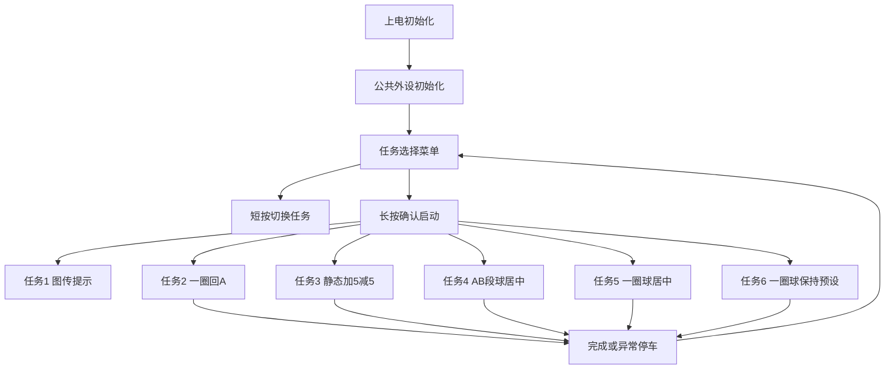
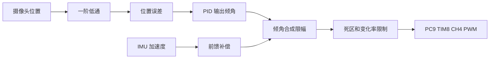
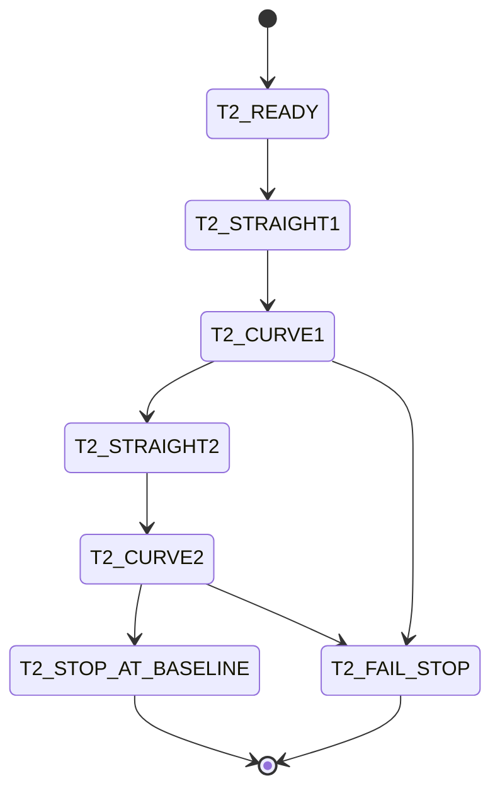
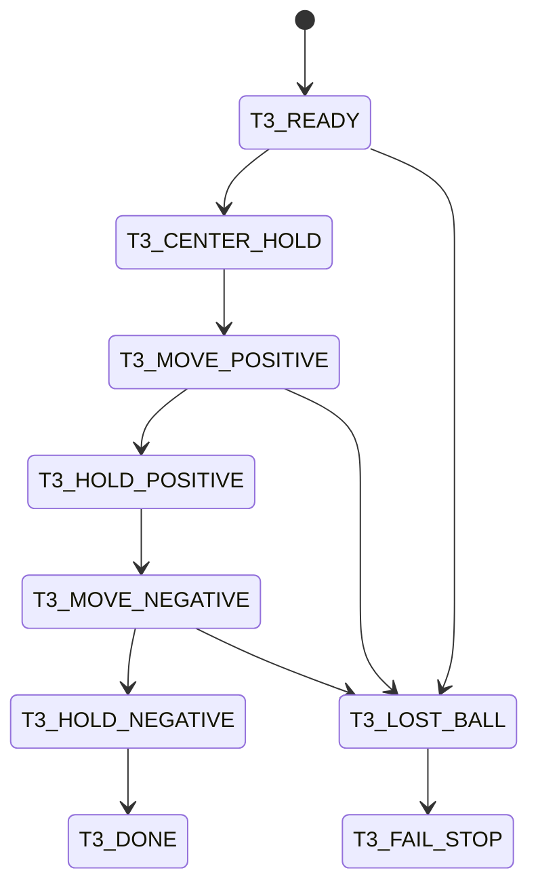
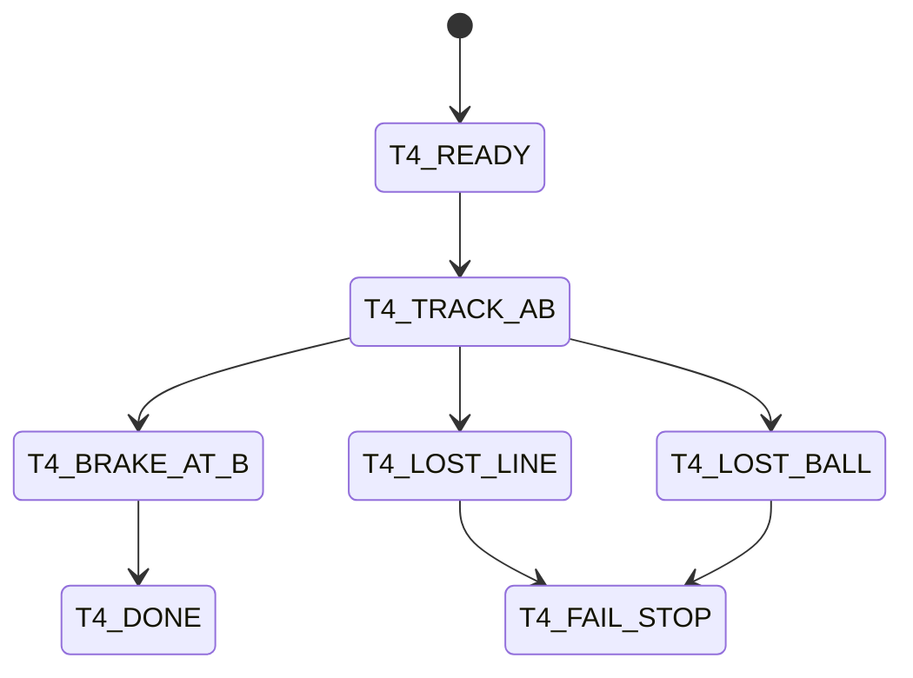
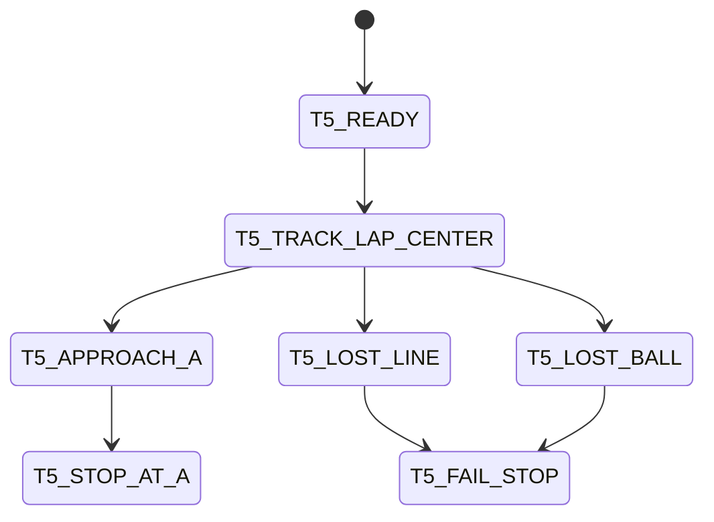
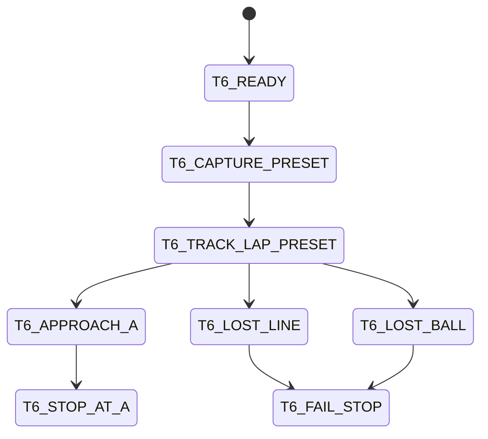

# 赛题实施方案：循迹模块与滚球稳定模块

本文档基于当前 STM32F4 / Keil / FreeRTOS 工程结构，规划 2026 年电赛选拔赛题的实施方案。赛题 6 个任务需要分开执行，其中任务 2 至任务 6 通过按键选择任务编号并确认启动，各自使用独立状态机实现。

## 1. 工程集成原则

1. 保持现有启动链路不变：`USER/main.c` -> `systemInit()` -> FreeRTOS 周期任务。
2. 保持现有工程简洁，不做复杂商业化抽象，只实现比赛所需驱动、状态机和控制逻辑。
3. 允许 AGENT 新增独立模块文件，例如 `HARDWARE/track_ir.c`、`HARDWARE/track_ir.h`、`BALANCE/contest_task.c`、`BALANCE/contest_task.h`、`BALANCE/ball_control.c`、`BALANCE/ball_control.h`。
4. 新增独立模块后，由用户手动加入 Keil 工程 `USER/WHEELTEC.uvprojx`；AGENT 不修改 `USER/WHEELTEC.uvprojx`。
5. 新增模块应少而清晰，推荐按功能划分为红外循迹、滚球控制、赛题任务状态机三类，避免碎片化文件过多。
6. 公共状态仍可通过 `BALANCE/system.c` 和 `BALANCE/system.h` 暴露，适配现有工程全局变量风格。

## 2. 两轮差速底盘参数

本赛题底盘按两轮差速车使用，对应工程中的 `Diff_Car`。实际轮系参数如下：

| 参数 | 实际值 | 工程对应项 | 当前处理 |
|---|---:|---|---|
| 编码器线数 | 13 | `Hall_13` | 已匹配 |
| 电机减速比 | 28 | `HALL_28F` | 已将 `Diff_Car` 从原 `HALL_30F` 改为 `HALL_28F` |
| 轮半径 | 0.0325 m | - | 用于核对轮径 |
| 轮直径 | 0.065 m | `Black_WheelDiameter` | 已匹配 |

编码器换算由 `Robot_Init()` 统一计算：

```c
Encoder_precision = EncoderMultiples * Robot_Parament.EncoderAccuracy * Robot_Parament.GearRatio;
Wheel_perimeter = Robot_Parament.WheelDiameter * PI;
```

其中 `EncoderMultiples = 4`，因此当前差速车一圈对应编码器计数为 `4 * 13 * 28 = 1456`。该参数直接影响 `Get_Velocity_Form_Encoder()` 中编码器脉冲到轮速 m/s 的换算；若仍使用原 30 减速比，会导致速度估算比例偏小，进而影响循迹内环速度控制。

## 3. 赛题任务拆分

| 序号 | 任务 | 是否需要状态机 | 主要控制单元 |
|---|---|---|---|
| 1 | 图传监测装置，实时回传并录制钢球画面 | 简单状态提示即可 | 图传设备为主，STM32 只做提示 |
| 2 | A 点启动，顺时针绕行一圈，回 A 停车并显示时间 | 需要独立状态机 | 红外循迹 |
| 3 | 小车静止，钢球中心到 +5cm，再到 -5cm 并稳定 | 需要独立状态机 | 滚球稳定 |
| 4 | A 点启动到 B 点，钢球保持中心 | 需要独立状态机 | 红外循迹 + 滚球稳定 |
| 5 | A 点启动绕行一圈回 A，钢球保持中心 | 需要独立状态机 | 红外循迹 + 滚球稳定 |
| 6 | 钢球任意预设位置，小车绕行一圈并保持该预设点 | 需要独立状态机 | 红外循迹 + 滚球稳定 |

## 4. 外设资源分配

### 4.1 已有资源沿用

| 资源 | 当前用途 | 本方案处理 |
|---|---|---|
| PC9 / TIM8 CH4 | 舵机 PWM | 保留，用于 MG996R 舵机 |
| TIM1 / TIM9 / TIM10 / TIM11 | 电机 PWM | 保留 |
| TIM2 / TIM3 / TIM4 / TIM5 | 编码器 | 保留 |
| USART1 PA9 / PA10 | 已初始化 115200，接收中断当前只丢弃数据 | 用于摄像头接收，PA10 接 RX |
| USART2 PD5 / PD6 | 蓝牙 APP / 调参 | 保留，不分配给红外 |
| UART5 PC12 / PD2 | 雷达解析 | 保留，不分配给红外 |
| UART4 PC10 / PC11 | 中央排针可用复用串口 | 按用户确认，可让出作为循迹 GPIO |
| ICM20948 | 当前指定陀螺仪 / IMU | 作为滚球控制的加速度前馈来源 |
| PE0 | 按键 | 用于任务选择、确认启动、强制停止 |
| PA12 或 PE8 | LED | 状态提示 |
| PA8 | 蜂鸣器 | 保留，尽量不占用 |
| PB0 / PB1 | ADC 电池/电位器 | 保留 |

### 4.2 9 路红外循迹 GPIO 初选

根据 `DOC/侧边引脚复用.md`，9 路红外循迹信号线改为使用中央排针。选脚原则如下：

1. 优先使用中央排针上普通 GPIO / ADC 复用脚。
2. 尽量不占用当前工程正在使用的串口资源：USART1 保留给摄像头，USART2 保留给蓝牙 APP / 调参，UART5 保留给雷达。
3. UART4 当前可不保留，因此 PC10 / PC11 可作为循迹 GPIO 使用。
4. 不使用 PA13 / PA14，避免影响 SWD 调试。
5. 不占用 PA8 蜂鸣器脚，保持声光提示能力。

| 通道 | 建议引脚 | 中央排针位置 | 逻辑位置 | 备注 |
|---|---|---|---|---|
| IR0 | PC11 | 左侧 | 最左 | 原 UART4_RX / USART3_RX 复用，本方案作 GPIO 输入 |
| IR1 | PA7 | 左侧 | 左 4 | 普通输入，ADC 复用可不用 |
| IR2 | PC5 | 左侧 | 左 3 | 普通输入，ADC 复用可不用 |
| IR3 | PC3 | 左侧 | 左 2 | 普通输入，ADC 复用可不用 |
| IR4 | PC2 | 左侧 | 中心 | 普通输入，ADC 复用可不用 |
| IR5 | PC1 | 左侧 | 右 2 | 普通输入，ADC 复用可不用 |
| IR6 | PC0 | 左侧 | 右 3 | 普通输入，ADC 复用可不用 |
| IR7 | PC10 | 右侧 | 右 4 | 原 UART4_TX / USART3_TX 复用，本方案作 GPIO 输入 |
| IR8 | PD15 | 右侧 | 最右 | 普通输入，TIM4_CH4 复用不用 |

备选说明：若后续需要恢复 UART4，可优先把 IR0 / IR7 改到 PA6 / PA5 / PA4 等中央排针引脚；但 PA4 / PA5 位于巡线接口且 PA4 带 USART2_CK 复用，需结合实际接线确认。

建议在 `HARDWARE/track_ir.h` 中集中定义：

```c
#define TRACK_IR0_PORT GPIOC
#define TRACK_IR0_PIN  GPIO_Pin_11
#define TRACK_IR1_PORT GPIOA
#define TRACK_IR1_PIN  GPIO_Pin_7
#define TRACK_IR2_PORT GPIOC
#define TRACK_IR2_PIN  GPIO_Pin_5
#define TRACK_IR3_PORT GPIOC
#define TRACK_IR3_PIN  GPIO_Pin_3
#define TRACK_IR4_PORT GPIOC
#define TRACK_IR4_PIN  GPIO_Pin_2
#define TRACK_IR5_PORT GPIOC
#define TRACK_IR5_PIN  GPIO_Pin_1
#define TRACK_IR6_PORT GPIOC
#define TRACK_IR6_PIN  GPIO_Pin_0
#define TRACK_IR7_PORT GPIOC
#define TRACK_IR7_PIN  GPIO_Pin_10
#define TRACK_IR8_PORT GPIOD
#define TRACK_IR8_PIN  GPIO_Pin_15
```

并增加黑线有效电平宏：

```c
#define TRACK_BLACK_LEVEL 0
```

若实际模块黑线输出高电平，只改为 `1`。

## 5. 建议新增模块

为保持工程简洁，建议新增 3 组独立模块。新增文件需要用户手动加入 Keil 工程。

| 模块 | 建议文件 | 职责 |
|---|---|---|
| 红外循迹 | `HARDWARE/track_ir.c` / `HARDWARE/track_ir.h` | 9 路 GPIO 初始化、读取、9bit 掩码、线位置误差计算 |
| 滚球控制 | `BALANCE/ball_control.c` / `BALANCE/ball_control.h` | 摄像头位置滤波、PID、IMU 前馈、舵机 PWM 输出限制 |
| 赛题任务 | `BALANCE/contest_task.c` / `BALANCE/contest_task.h` | 任务选择菜单、任务 1 到任务 6 状态机、公共安全输出 |

仍需修改的已有文件：

| 文件 | 修改目的 |
|---|---|
| `BALANCE/system.c` | 定义公共全局状态、默认参数，在 `systemInit()` 中调用红外初始化 |
| `BALANCE/system.h` | 声明公共结构体、枚举、全局变量和函数接口 |
| `HARDWARE/usartx.c` | 将 USART1 接收中断改为摄像头 5 字节帧解析 |
| `HARDWARE/usartx.h` | 增加摄像头接收状态访问接口声明 |
| `BALANCE/balance.c` | 在现有周期控制任务中调用赛题状态机调度函数 |
| `USER/main.c` | 尽量不改；若后续确实独立建任务，再评估是否创建新 FreeRTOS 任务 |

## 6. 总体软件结构



## 7. 按键交互方案

复用 PE0 按键。为了降低现场误操作，建议只使用短按和长按：

| 场景 | 短按 | 长按 |
|---|---|---|
| 菜单态 | 任务号 1 到 6 循环切换 | 确认并启动当前任务 |
| 运行态 | 无动作或显示页切换 | 强制停止，回菜单 |
| 完成态 | 返回菜单或切换显示 | 返回菜单 |

OLED 显示建议：

- 菜单态：显示 `TASK 1` 到 `TASK 6`、任务名称简写。
- 运行态：显示任务号、子状态、计时、红外 mask、球位置、异常标志。
- 完成态：显示总时间、是否丢线、是否丢球、最终停车状态。

当前工程实现已将 `oled_show()` 固定为赛题专用显示页：先清空 `OLED_GRAM`，再显示 `Contest Diff`、当前任务号、执行时间，以及 `Short: select` / `Long : start` 提示。底盘固定为两轮差速车，`MotorA` 作为左轮、`MotorB` 作为右轮；短按只在菜单态切换任务，长按只在菜单态启动当前任务。

## 8. 摄像头数据接收方案

### 8.1 串口选择

使用 USART1：

- PA10：STM32 RX，连接摄像头 TX。
- PA9：STM32 TX，可选用于调试。
- 波特率沿用 115200。

### 8.2 帧格式

用户定义定长 5 字节，无校验：

| 字节偏移 | 含义 | 值 |
|---|---|---|
| 0 | 帧头 | `0xAA` |
| 1 | 指令码 | `0x01` 位置，`0x02` 丢失，`0x03` 心跳 |
| 2 | 数据高 8 位 | `(data >> 8) & 0xFF` |
| 3 | 数据低 8 位 | `data & 0xFF` |
| 4 | 帧尾 | `0xBB` |

位置为 `int16_t`，单位 0.1mm。示例：12.5cm -> 1250 -> `AA 01 04 E2 BB`。

### 8.3 解析策略

1. USART1 RX 中断逐字节进入状态机。
2. 等待帧头 `0xAA`。
3. 收满 5 字节后检查帧尾 `0xBB`。
4. `CMD=0x01`：解析 `int16_t` 位置，更新最新位置、在线状态和时间戳。
5. `CMD=0x02`：置丢球标志，不更新有效位置。
6. `CMD=0x03`：更新心跳计数和在线时间戳。
7. 超过设定控制周期无位置或心跳，进入视觉失效保护。

建议摄像头状态结构：

```c
typedef struct
{
    int16_t raw_pos_0p1mm;
    float filtered_pos_0p1mm;
    uint8_t ball_lost;
    uint8_t online;
    uint16_t heartbeat;
    uint32_t last_update_tick;
    uint16_t frame_error_count;
} CameraBallState_t;
```

## 9. 滚球稳定控制方案

滚球稳定按照舵机方案实现：视觉位置反馈 + 一阶低通 + 位置 PID + IMU 加速度前馈 + 舵机输出约束。



### 9.1 控制细节

1. 内部位置单位建议使用 0.1mm，与协议一致。
2. 目标位置按任务决定：
   - 任务 3：先 0cm，再 +5cm，再 -5cm。
   - 任务 4：0cm。
   - 任务 5：0cm。
   - 任务 6：启动前捕获当前球位置作为目标。
3. 一阶低通：初始 `alpha = 0.25`，现场调参。
4. PID 输出为轨道目标倾角，不做舵机角度内环。
5. IMU 前馈用于抵消小车加减速导致的钢球惯性偏移。
6. 舵机 PWM 以 `SERVO_INIT` 为中心，做机械限幅。
7. 对舵机输出做变化率限制，避免快速抖动。
8. 丢球或心跳超时后，舵机保持最后安全值或缓慢回中；移动任务中建议同时降低车速或停车。

### 9.2 稳定判据

建议统一函数判断滚球是否稳定：

- 绝对误差小于等于 1cm，即 `abs(error_0p1mm) <= 100`。
- 连续若干个控制周期满足该误差。
- 位置变化速度低于阈值，防止刚穿越目标点就误判稳定。

## 10. 红外循迹控制方案

### 10.1 传感器抽象

9 路红外从左到右编号 IR0 到 IR8，读取为 9bit mask。

建议计算：

- `line_mask`：9bit 原始有效线掩码。
- `line_valid`：是否检测到黑线。
- `line_error`：加权位置误差。
- `line_width`：有效通道数量。
- `line_lost_count`：连续丢线计数。
- `last_error`：丢线搜索方向。

权重：

| 通道 | IR0 | IR1 | IR2 | IR3 | IR4 | IR5 | IR6 | IR7 | IR8 |
|---|---|---|---|---|---|---|---|---|---|
| 权重 | -4 | -3 | -2 | -1 | 0 | +1 | +2 | +3 | +4 |

### 10.2 循迹控制

1. 基础速度由任务决定。
2. 转向控制使用 `line_error` 的 PD 输出。
3. 任务 4、5、6 中，若滚球误差增大，动态降低基础速度。
4. 短时丢线时，按 `last_error` 方向搜索。
5. 长时间丢线时进入保护停车。
6. A 点、B 点识别单独抽象，不直接混入普通 line_error 计算。

### 10.3 A/B 点识别建议

A 点和 B 点如果有横线或宽线标志，可用以下特征组合：

- 有效通道数量突然增多。
- 中间多路同时有效。
- 特征持续超过若干周期。
- 起跑后对 A 点识别设置屏蔽区，避免刚启动即误判回到 A。

如果 B 点没有明显红外特征，应使用编码器里程作为辅助判定。

## 11. 任务状态机设计

### 11.1 任务 1：电机调试任务

当前工程将任务 1 临时用作两轮差速底盘的电机调试任务，并作为上电默认选中任务。该任务只给 MotorA 左轮、MotorB 右轮下发固定同向目标线速度，不运行循迹、滚球、IMU 角度环，用于确认电机方向、编码器测速和电机速度 PI 参数是否合理。

| 状态 | 行为 |
|---|---|
| T1_READY | 上电默认显示 `Motor Debug` 页面，电机停止，等待长按启动 |
| T1_MOTOR_RUN | 长按后 MotorA/MotorB 同速旋转，目标线速度由 `CONTEST_TASK1_MOTOR_DEBUG_SPEED` 设置 |
| T1_STOP | 运行中再次长按强制停止，回到菜单/调试显示页 |

OLED 调试页显示内容：MotorA/MotorB 编码器换算后的线速度值、目标线速度、电机速度 PI 参数 `Velocity_KP` 和 `Velocity_KI`、运行时间。若实测 A/B 速度符号不一致或与目标方向相反，优先检查差速车编码器极性和 PWM 极性；若速度震荡或跟随慢，再调整 `Velocity_KP` / `Velocity_KI`。

### 11.2 任务 2：两段直行 + 两段顺时针半圆

当前工程已在 `BALANCE/contest_task.c` 中实现任务 2 专用状态机。菜单态短按切换到任务 2，长按确认启动；启动后 `state_time_ms` 开始计时，完成停车时锁定 `finished_time_ms` 供 OLED 显示。



| 状态 | 控制策略 |
|---|---|
| T2_READY | 菜单态选中任务 2；长按后清零计时、清零相位距离和积分偏航角 |
| T2_STRAIGHT1 | 左右轮同速前进，积分编码器速度，直行 1.5m；用 ICM20948 yaw 角做小比例修正 |
| T2_CURVE1 | 启动 9 路红外循迹外环，沿赛道顺时针通过半径 0.5m 的半圆；通过约 180° yaw 变化、半圆弧长或超时判定出弯 |
| T2_STRAIGHT2 | 出弯后以新的 yaw 作为直行基准，再直行 1.5m |
| T2_CURVE2 | 再次红外循迹通过第二个顺时针半圆；完成半圆后等待停车基准线宽线特征 |
| T2_STOP_AT_BASELINE | 检测到停车基准线或超时保护后立即清零目标速度，停止计时并在 OLED 保留总时间 |
| T2_FAIL_STOP | 循迹丢线超时等保护停车，锁定当次运行时间 |

任务 2 关键参数集中在 `BALANCE/contest_task.c` 顶部：直线距离 `1.50m`、半圆半径 `0.50m`、半圆弧长 `3.1416 * 0.50m`、调试基础速度 `0.28m/s`、弯道保护超时 `12s`。顺时针方向最终由 9 路传感器顺序、黑线电平和 `TRACK_TURN_DIR` 符号共同决定，实车若反向需优先调整 `BALANCE/track_control.h` 中的方向符号或传感器排列。

### 11.3 任务 3：静态 +5cm / -5cm



| 状态 | 控制策略 |
|---|---|
| T3_READY | 电机停止，等待摄像头在线 |
| T3_CENTER_HOLD | 目标位置 0cm，短暂稳定 |
| T3_MOVE_POSITIVE | 目标位置 +5cm |
| T3_HOLD_POSITIVE | 判断 +5cm 稳定 |
| T3_MOVE_NEGATIVE | 目标位置 -5cm |
| T3_HOLD_NEGATIVE | 判断 -5cm 稳定 |
| T3_DONE | 停止计时，保持安全输出 |
| T3_LOST_BALL | 视觉失效保护 |

### 11.4 任务 4：AB 段球居中



| 状态 | 控制策略 |
|---|---|
| T4_READY | 等待红外有效、摄像头在线，球目标 0cm |
| T4_TRACK_AB | 循迹 + 球居中，速度较保守 |
| T4_BRAKE_AT_B | 检测 B 点后制动 |
| T4_DONE | 显示 AB 段用时 |
| T4_LOST_LINE | 保护停车 |
| T4_LOST_BALL | 保护停车 |

### 11.5 任务 5：一圈球居中



| 状态 | 控制策略 |
|---|---|
| T5_READY | 球目标 0cm，等待红外和视觉有效 |
| T5_TRACK_LAP_CENTER | 循迹 + 球居中，球误差大时降速 |
| T5_APPROACH_A | 回 A 后减速 |
| T5_STOP_AT_A | 停车并显示整圈总时长 |
| T5_LOST_LINE | 保护停车 |
| T5_LOST_BALL | 保护停车 |

### 11.6 任务 6：一圈保持预设球位



| 状态 | 控制策略 |
|---|---|
| T6_READY | 等待球静止和视觉在线 |
| T6_CAPTURE_PRESET | 捕获当前滤波球位置作为目标位置 |
| T6_TRACK_LAP_PRESET | 循迹 + 保持预设球位 |
| T6_APPROACH_A | 回 A 后减速 |
| T6_STOP_AT_A | 停车显示总时长 |
| T6_LOST_LINE | 保护停车 |
| T6_LOST_BALL | 保护停车 |

## 12. 周期调度建议

优先不新增 FreeRTOS 任务，而是在现有周期控制任务中调用：

```c
void Contest_Task_Update(void)
{
    Contest_Key_Update();
    Contest_Sensors_Update();

    switch (contest.current_task)
    {
        case CONTEST_TASK_1_VIDEO:
            Contest_Task1_Update();
            break;
        case CONTEST_TASK_2_LAP_ONLY:
            Contest_Task2_Update();
            break;
        case CONTEST_TASK_3_STATIC_BALL:
            Contest_Task3_Update();
            break;
        case CONTEST_TASK_4_AB_CENTER:
            Contest_Task4_Update();
            break;
        case CONTEST_TASK_5_LAP_CENTER:
            Contest_Task5_Update();
            break;
        case CONTEST_TASK_6_LAP_PRESET:
            Contest_Task6_Update();
            break;
    }

    Contest_Output_Apply();
}
```

这样循迹、滚球、计时、安全输出都在同一控制周期内更新，减少跨任务同步复杂度。

## 13. 实施步骤清单

1. 新增 `HARDWARE/track_ir.c` 和 `HARDWARE/track_ir.h`，实现 PF0 到 PF8 红外初始化、读取和线误差计算。
2. 新增 `BALANCE/ball_control.c` 和 `BALANCE/ball_control.h`，实现滚球滤波、PID、前馈、舵机 PWM 限幅和稳定判据。
3. 新增 `BALANCE/contest_task.c` 和 `BALANCE/contest_task.h`，实现任务选择菜单和任务 1 到任务 6 状态机。
4. 修改 `BALANCE/system.h`，加入公共状态结构、任务枚举、外部变量和接口声明。
5. 修改 `BALANCE/system.c`，定义公共状态、默认参数，并在初始化阶段调用红外初始化。
6. 修改 `HARDWARE/usartx.c`，将 USART1 接收中断改造为摄像头 5 字节帧解析。
7. 修改 `HARDWARE/usartx.h`，声明摄像头数据访问接口。
8. 修改 `BALANCE/balance.c`，在现有控制周期中调用 `Contest_Task_Update()`。
9. 增加 OLED/LED/蜂鸣器提示：任务号、状态、时间、红外 mask、球位置、异常标志。
10. 用户在 Keil 中手动将新增 `.c` 文件加入 `USER/WHEELTEC.uvprojx` 对应分组。
11. 编译 `FreeRTOS` target，修正声明和类型问题。
12. 上车调试顺序：按键菜单 -> 红外极性 -> A/B 特征 -> 摄像头帧 -> 舵机零位 -> 任务 3 -> 任务 2 -> 任务 4 -> 任务 5 -> 任务 6。

## 14. 调参优先级

1. 先确认红外传感器黑线电平和 9bit mask 顺序。
2. 再确认摄像头帧解析、位置符号方向和单位。
3. 调整舵机机械零位和 PWM 安全限幅。
4. 静态调任务 3 的滚球 PID。
5. 单独调任务 2 的循迹速度和转向 PD。
6. 联调任务 4，确认移动中球居中策略。
7. 联调任务 5，逐步提高整圈速度。
8. 最后调任务 6，重点验证预设位置捕获和保持。

## 15. 关键风险与处理

| 风险 | 处理 |
|---|---|
| 新增文件未加入 Keil 导致不参与编译 | 用户手动加入 `USER/WHEELTEC.uvprojx` |
| 红外模块电平与假设相反 | 修改 `TRACK_BLACK_LEVEL` 宏 |
| A 点刚启动被误判为完成 | 起跑后设置 A 点识别屏蔽区 |
| B 点无明显红外特征 | 使用编码器里程辅助 |
| 摄像头丢球 | 舵机保持或回中，移动任务停车保护 |
| 小车加减速导致球偏移 | 使用 IMU 加速度前馈和动态限速 |
| 为追求速度导致球误差超限 | 球误差与车速联动，误差大时降速 |

## 16. 结论

本方案将 6 个赛题任务明确拆分，任务 2 至任务 6 均由独立状态机执行；底层复用红外循迹、摄像头接收、滚球 PID、舵机输出和安全停车模块。允许新增独立模块文件，但新增数量控制在必要范围内，并由用户手动加入 Keil 工程，以保持现有工程简洁、清晰、可调试。

